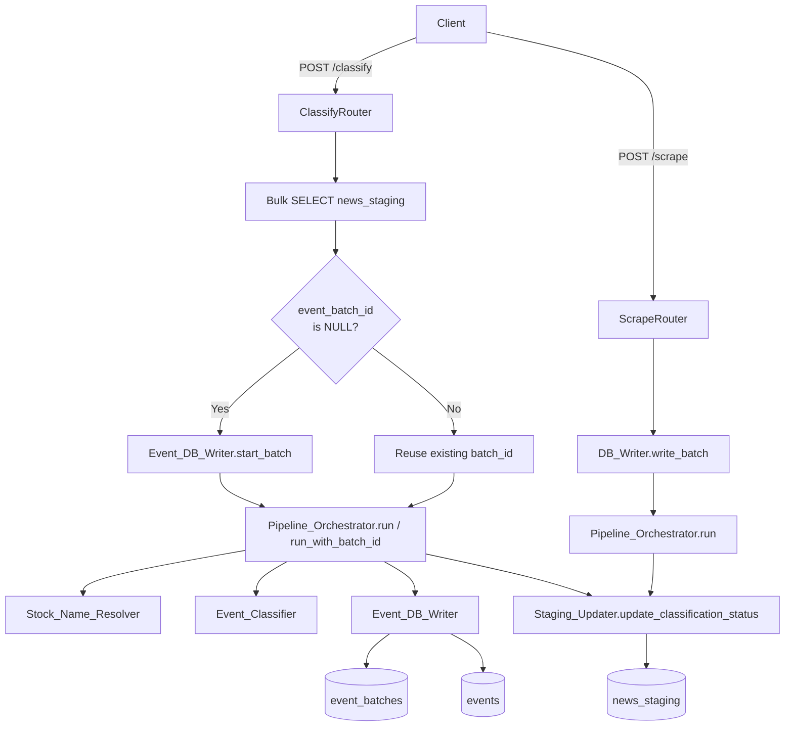

# Design Document: classify-api-staging-enhancement

## Overview

This feature adds two capabilities to the MoneyControl scraper pipeline:

1. **`POST /classify` endpoint** — a synchronous API that accepts a list of `news_staging.id` values and runs the full classification pipeline for each, returning a structured summary of what was processed, inserted, and failed.

2. **Classification tracking on `news_staging`** — four new columns (`event_batch_id`, `stocks_loaded`, `stocks_failed`, `classification_status`) that record the outcome of every pipeline run, whether triggered manually via `POST /classify` or automatically via the `POST /scrape` background task.

The design reuses all existing pipeline components (`Pipeline_Orchestrator`, `Event_DB_Writer`, `Stock_Name_Resolver`, `Event_Classifier`) and introduces two new components: `Staging_Updater` (a DB helper) and the `classify` router. The `Pipeline_Orchestrator` gains a `run_with_batch_id` method to support the retry path.

---

## Architecture



**Key architectural decisions:**

- `POST /classify` runs **synchronously** — each record's pipeline run is awaited before the next begins. This is intentional: the caller needs the full result immediately, and the number of records is bounded at 50.
- `POST /scrape` continues to use `asyncio.create_task` for background pipeline execution. The `Staging_Updater` call is added inside the background task after `orchestrator.run` completes.
- `Staging_Updater` is a standalone class in `app/db/staging_updater.py`, not embedded in the router or orchestrator, so both code paths share the same status-determination logic.
- The `Pipeline_Orchestrator` gains `run_with_batch_id` to accept a pre-existing `batch_id` on the retry path, avoiding a second `start_batch` call.

---

## Components and Interfaces

### New: `app/db/staging_updater.py` — `Staging_Updater`

```python
class Staging_Updater:
    def __init__(self, pool: asyncpg.Pool, schema: str) -> None: ...

    async def update_classification_status(
        self,
        staging_id: int,
        batch_id: int,
        summary: PipelineSummary,
        url: str,
        schema: str,
    ) -> None:
        """
        Compute classification_status from summary and issue a single UPDATE
        to news_staging for the given staging_id.

        Status logic:
          - complete : db_inserted > 0 AND db_failures == 0 AND unresolved == 0
          - partial  : db_inserted > 0 AND (db_failures > 0 OR unresolved > 0)
          - failed   : db_inserted == 0 AND total > 0
          - failed   : total == 0

        On retry (existing batch_id reused), calls get_cumulative_loaded()
        to compute the true stocks_loaded from the events table.
        """

    async def get_cumulative_loaded(
        self,
        batch_id: int,
        source_url: str,
        schema: str,
    ) -> int:
        """
        SELECT COUNT(*) FROM stoxscoop_dev.events
        WHERE batch_id = $1 AND source_url = $2
        Returns the count as an integer.
        """
```

**Status determination logic** (pure, no I/O):

```
determine_status(summary: PipelineSummary) -> str:
    if summary.total == 0:
        return "failed"
    if summary.db_inserted > 0 and summary.db_failures == 0 and summary.unresolved == 0:
        return "complete"
    if summary.db_inserted > 0 and (summary.db_failures > 0 or summary.unresolved > 0):
        return "partial"
    return "failed"  # db_inserted == 0 and total > 0
```

This pure function is extracted as a module-level helper so it can be unit-tested independently of the DB.

**Retry path** — when `event_batch_id` is reused, `stocks_loaded` is not taken from `summary.db_inserted` (which only counts the current run's new inserts). Instead, `get_cumulative_loaded` queries the total events already in the DB for that `batch_id` + `source_url` combination, giving the true cumulative count across all runs.

---

### New: `app/routers/classify.py` — `POST /classify`

```python
router = APIRouter()

@router.post("/classify", response_model=ClassifyResponse)
async def classify(request: ClassifyRequest, req: Request) -> ClassifyResponse:
    """
    Synchronous classification endpoint.

    1. Deduplicate request.ids (preserve first occurrence).
    2. Bulk SELECT news_staging WHERE id = ANY($1).
    3. For each row:
       a. If content is NULL or empty → ids_skipped, set status=failed via Staging_Updater.
       b. If event_batch_id is NULL → start_batch → run().
       c. If event_batch_id is NOT NULL → run_with_batch_id().
       d. Capture PipelineSummary → call Staging_Updater.
       e. Accumulate response counts.
    4. IDs not returned by SELECT → ids_missing.
    5. Return ClassifyResponse.
    """
```

**Error handling within the loop:**
- `start_batch` raises → log, add to `ids_skipped`, call `Staging_Updater` with a synthetic failed summary, continue.
- `orchestrator.run` / `run_with_batch_id` raises → log with `staging_id`, add to `ids_skipped`, continue.
- `Staging_Updater.update_classification_status` raises → log with `staging_id`, continue (do not alter HTTP status).
- Bulk SELECT raises → return HTTP 503 immediately.

---

### New: `app/pipeline/orchestrator.py` — `run_with_batch_id`

```python
async def run_with_batch_id(
    self,
    record: OutputRecord,
    batch_id: int,
) -> PipelineSummary:
    """
    Identical to run() but accepts a pre-existing batch_id instead of
    calling start_batch. Does NOT call finish_batch (the batch was
    started in a prior run; only total_events would be stale).

    Steps:
      1. Skip start_batch — use provided batch_id directly.
      2. Iterate stock entries, resolve, classify, write_event.
      3. Call finish_batch in finally block to update total_events.
      4. Return PipelineSummary.
    """
```

The `run_with_batch_id` method still calls `finish_batch` in its `finally` block so `event_batches.total_events` and `completed_at` are kept current after each retry run.

---

### Updated: `app/schemas.py` — new Pydantic models

```python
class ClassifyRequest(BaseModel):
    ids: list[int]

    @field_validator("ids", mode="after")
    @classmethod
    def validate_ids(cls, v: list[int]) -> list[int]:
        if len(v) == 0:
            raise ValueError("At least one ID is required.")
        if len(v) > 50:
            raise ValueError("At most 50 IDs are allowed per request.")
        for val in v:
            if val <= 0:
                raise ValueError("All IDs must be positive integers.")
        return v


class ClassifyResponse(BaseModel):
    ids_processed: list[int]      # found in news_staging with stock entries
    ids_missing: list[int]        # not found in news_staging
    ids_skipped: list[int]        # null/empty content, pipeline exception, or start_batch failure
    total_stocks: int             # sum of PipelineSummary.total
    events_inserted: int          # sum of PipelineSummary.db_inserted
    events_failed: int            # sum of PipelineSummary.db_failures
    unresolved_stocks: int        # sum of PipelineSummary.unresolved
```

---

### Updated: `app/routers/scrape.py`

The `_run_pipeline` background task is updated to:
1. Accept `staging_id: int | None` as a parameter (obtained from `DB_Writer.write_batch` return value — see below).
2. After `orchestrator.run` completes, call `Staging_Updater.update_classification_status(staging_id, batch_id, summary, url, schema)`.
3. If `staging_id` is `None` (record was skipped as duplicate), log a WARNING with the article URL and skip the status update.

`DB_Writer.write_batch` is updated to return `tuple[int, int, dict[str, int]]` where the third element maps `url → staging_id` for inserted rows, enabling the scrape router to pass the correct `staging_id` to the background task.

---

### Updated: `app/main.py`

```python
from app.routers import classify  # new import

app.include_router(classify.router)  # added after existing routers
```

---

### New: `migrations/001_add_classification_tracking.sql`

```sql
-- Idempotent migration: add classification-tracking columns to news_staging

ALTER TABLE stoxscoop_dev.news_staging
    ADD COLUMN IF NOT EXISTS event_batch_id integer
        REFERENCES stoxscoop_dev.event_batches(id) ON DELETE SET NULL;

ALTER TABLE stoxscoop_dev.news_staging
    ADD COLUMN IF NOT EXISTS stocks_loaded integer NOT NULL DEFAULT 0;

ALTER TABLE stoxscoop_dev.news_staging
    ADD COLUMN IF NOT EXISTS stocks_failed integer NOT NULL DEFAULT 0;

ALTER TABLE stoxscoop_dev.news_staging
    ADD COLUMN IF NOT EXISTS classification_status varchar(20) NOT NULL DEFAULT 'pending';

-- Backfill pre-existing rows
UPDATE stoxscoop_dev.news_staging
SET classification_status = 'pending',
    stocks_loaded = 0,
    stocks_failed = 0
WHERE classification_status IS NULL;

-- Check constraints (idempotent)
ALTER TABLE stoxscoop_dev.news_staging
    ADD CONSTRAINT IF NOT EXISTS chk_classification_status
        CHECK (classification_status IN ('pending', 'partial', 'complete', 'failed'));

ALTER TABLE stoxscoop_dev.news_staging
    ADD CONSTRAINT IF NOT EXISTS chk_stocks_non_negative
        CHECK (stocks_loaded >= 0 AND stocks_failed >= 0);
```

---

## Data Models

### `news_staging` — new columns

| Column | Type | Nullable | Default | Constraint |
|---|---|---|---|---|
| `event_batch_id` | `integer` | YES | NULL | FK → `event_batches(id)` ON DELETE SET NULL |
| `stocks_loaded` | `integer` | NO | `0` | `>= 0` |
| `stocks_failed` | `integer` | NO | `0` | `>= 0` |
| `classification_status` | `varchar(20)` | NO | `'pending'` | IN ('pending','partial','complete','failed') |

### `ClassifyRequest`

| Field | Type | Constraints |
|---|---|---|
| `ids` | `list[int]` | 1–50 elements, all positive integers, deduplicated before processing |

### `ClassifyResponse`

| Field | Type | Description |
|---|---|---|
| `ids_processed` | `list[int]` | IDs found in DB with stock entries, pipeline was invoked |
| `ids_missing` | `list[int]` | IDs not found in `news_staging` |
| `ids_skipped` | `list[int]` | IDs with null/empty content, or pipeline/start_batch failure |
| `total_stocks` | `int` | Sum of `PipelineSummary.total` across all runs |
| `events_inserted` | `int` | Sum of `PipelineSummary.db_inserted` |
| `events_failed` | `int` | Sum of `PipelineSummary.db_failures` |
| `unresolved_stocks` | `int` | Sum of `PipelineSummary.unresolved` |

### `PipelineSummary` (existing, unchanged)

| Field | Type | Description |
|---|---|---|
| `total` | `int` | Total stock entries in the article |
| `resolved` | `int` | Successfully resolved to ticker IDs |
| `unresolved` | `int` | Could not be resolved |
| `classified` | `int` | Successfully classified by LLM |
| `classification_failures` | `int` | LLM classification failures |
| `db_inserted` | `int` | Events written to DB |
| `db_failures` | `int` | DB write failures (including duplicates on new runs) |

---

## Correctness Properties

*A property is a characteristic or behavior that should hold true across all valid executions of a system — essentially, a formal statement about what the system should do. Properties serve as the bridge between human-readable specifications and machine-verifiable correctness guarantees.*

### Property 1: Valid `ids` lists are accepted; invalid ones are rejected

*For any* list of integers, `ClassifyRequest` validation SHALL accept the list if and only if it contains between 1 and 50 elements and every element is a positive integer (> 0).

**Validates: Requirements 1.1, 1.3, 1.4**

---

### Property 2: Deduplication preserves first occurrence

*For any* `ids` list containing duplicate values, the set of IDs actually processed (union of `ids_processed`, `ids_missing`, `ids_skipped`) SHALL equal the set of unique values from the original list, with no ID appearing more than once across those three lists.

**Validates: Requirements 1.5**

---

### Property 3: Every requested ID appears in exactly one response list

*For any* valid `ClassifyRequest`, every deduplicated ID in the request SHALL appear in exactly one of `ids_processed`, `ids_missing`, or `ids_skipped` in the `ClassifyResponse` — never in two lists, never absent from all three.

**Validates: Requirements 2.1, 2.2, 2.3, 6.2**

---

### Property 4: Classification status is a pure function of `PipelineSummary`

*For any* `PipelineSummary`, `determine_status` SHALL return:
- `"complete"` if and only if `db_inserted > 0` AND `db_failures == 0` AND `unresolved == 0`
- `"partial"` if and only if `db_inserted > 0` AND (`db_failures > 0` OR `unresolved > 0`)
- `"failed"` if and only if `db_inserted == 0` (regardless of `total`) OR `total == 0`

These three cases are mutually exclusive and exhaustive over all non-negative integer combinations.

**Validates: Requirements 5.2, 5.3, 5.4, 5.5**

---

### Property 5: Response aggregates correctly reflect pipeline summaries

*For any* set of pipeline runs that complete without exception, the `ClassifyResponse` fields SHALL satisfy:
- `total_stocks == sum(s.total for s in summaries)`
- `events_inserted == sum(s.db_inserted for s in summaries)`
- `events_failed == sum(s.db_failures for s in summaries)`
- `unresolved_stocks == sum(s.unresolved for s in summaries)`
- `len(ids_processed) == number of records for which the pipeline was invoked`

**Validates: Requirements 6.2**

---

### Property 6: Single-record failure does not prevent other records from being processed

*For any* batch of N eligible records where exactly one raises an exception during `Pipeline_Orchestrator.run`, the remaining N-1 records SHALL be processed and appear in `ids_processed`, and the failing record SHALL appear in `ids_skipped`.

**Validates: Requirements 4.4, 9.2**

---

## Error Handling

### Bulk SELECT failure (Requirement 9.1)
If the initial `SELECT` from `news_staging` raises any exception, the endpoint returns HTTP 503 immediately with the message `"database connectivity issue"`. No pipeline work is attempted.

### `start_batch` failure (Requirements 3.4, 9.5)
If `Event_DB_Writer.start_batch` raises for a NULL-batch record:
- Log the error at ERROR level with the `staging_id` and exception message.
- Add the `staging_id` to `ids_skipped`.
- Call `Staging_Updater` with a synthetic `PipelineSummary(total=0, ...)` to set `classification_status = 'failed'`.
- Continue to the next record.

### `Pipeline_Orchestrator.run` / `run_with_batch_id` failure (Requirement 4.4)
- Log at ERROR level with `staging_id` and exception message.
- Add `staging_id` to `ids_skipped` (not `ids_processed`).
- Continue to the next record.

### `Staging_Updater` failure (Requirements 9.3, 9.4)
- Log at ERROR level with `staging_id` and exception message.
- If the log call itself raises, swallow silently.
- Continue processing remaining records.
- HTTP response status is unaffected (still 200).

### `POST /scrape` — missing `staging_id` (Requirement 8.3)
If `DB_Writer.write_batch` returns `None` for a record's `staging_id` (e.g., duplicate URL was skipped), the background task logs a WARNING containing the article URL and skips the `Staging_Updater` call for that record.

---

## Testing Strategy

### Unit Tests

Focus on specific examples, edge cases, and error conditions:

- `ClassifyRequest` validation: empty list, list of 51, zero value, negative value, float value, valid list of 1, valid list of 50.
- `determine_status` helper: all four status outcomes with concrete `PipelineSummary` values.
- `Staging_Updater.update_classification_status`: mock DB, verify correct SQL parameters for each status case.
- `Staging_Updater.get_cumulative_loaded`: mock DB, verify correct query and return value.
- `POST /classify` router: mock all dependencies; test missing IDs, null content, `start_batch` failure, pipeline exception, `Staging_Updater` failure, HTTP 503 on bulk SELECT failure.
- `POST /scrape` integration with `Staging_Updater`: mock `DB_Writer` to return a known `staging_id`; verify `Staging_Updater` is called with that ID.
- `Pipeline_Orchestrator.run_with_batch_id`: verify `start_batch` is NOT called; verify `finish_batch` IS called.

### Property-Based Tests (Hypothesis)

This feature is well-suited for property-based testing because the core logic — input validation, deduplication, status determination, and response aggregation — consists of pure functions with large input spaces.

**Library:** [Hypothesis](https://hypothesis.readthedocs.io/) (already present in the project via `.hypothesis/` directory)

**Minimum iterations:** 100 per property test (`@settings(max_examples=100)`)

**Tag format:** `# Feature: classify-api-staging-enhancement, Property {N}: {property_text}`

#### Property Test 1 — `ClassifyRequest` validation
```
# Feature: classify-api-staging-enhancement, Property 1: Valid ids lists are accepted; invalid ones are rejected
@given(ids=st.lists(st.integers()))
@settings(max_examples=200)
def test_classify_request_validation(ids): ...
```
Generates arbitrary integer lists; asserts that validation succeeds iff 1 ≤ len(ids) ≤ 50 and all values > 0.

#### Property Test 2 — Deduplication
```
# Feature: classify-api-staging-enhancement, Property 2: Deduplication preserves first occurrence
@given(ids=st.lists(st.integers(min_value=1, max_value=100), min_size=1, max_size=50))
def test_deduplication(ids): ...
```
Generates lists with potential duplicates; asserts the processed set equals the unique set.

#### Property Test 3 — ID partition completeness
```
# Feature: classify-api-staging-enhancement, Property 3: Every requested ID appears in exactly one response list
@given(...)
def test_id_partition(ids, present_ids, content_ids): ...
```
Mocks the DB to return a known subset; asserts every ID appears in exactly one of the three response lists.

#### Property Test 4 — Status determination
```
# Feature: classify-api-staging-enhancement, Property 4: Classification status is a pure function of PipelineSummary
@given(summary=st.builds(PipelineSummary, ...))
@settings(max_examples=500)
def test_determine_status(summary): ...
```
Generates arbitrary non-negative `PipelineSummary` values; asserts the returned status matches the specification exactly.

#### Property Test 5 — Response aggregation
```
# Feature: classify-api-staging-enhancement, Property 5: Response aggregates correctly reflect pipeline summaries
@given(summaries=st.lists(st.builds(PipelineSummary, ...), min_size=1, max_size=50))
def test_response_aggregation(summaries): ...
```
Generates lists of summaries; asserts all response count fields equal the corresponding sums.

#### Property Test 6 — Single-record failure resilience
```
# Feature: classify-api-staging-enhancement, Property 6: Single-record failure does not prevent other records from being processed
@given(n=st.integers(min_value=2, max_value=10), fail_idx=st.integers(min_value=0))
def test_single_failure_resilience(n, fail_idx): ...
```
Mocks orchestrator to raise for one record; asserts N-1 records are processed and the failing one is in `ids_skipped`.

### Integration Tests

- Run migration SQL against a test schema; verify columns and constraints exist; run again to verify idempotency.
- End-to-end `POST /classify` with a real test DB: insert staging records, call endpoint, verify `news_staging` rows are updated.
- `POST /scrape` background task: verify `news_staging` classification columns are updated after the background task completes.
- Retry path: call `POST /classify` twice for the same record; verify second run reuses `event_batch_id` and `stocks_loaded` reflects cumulative count.
