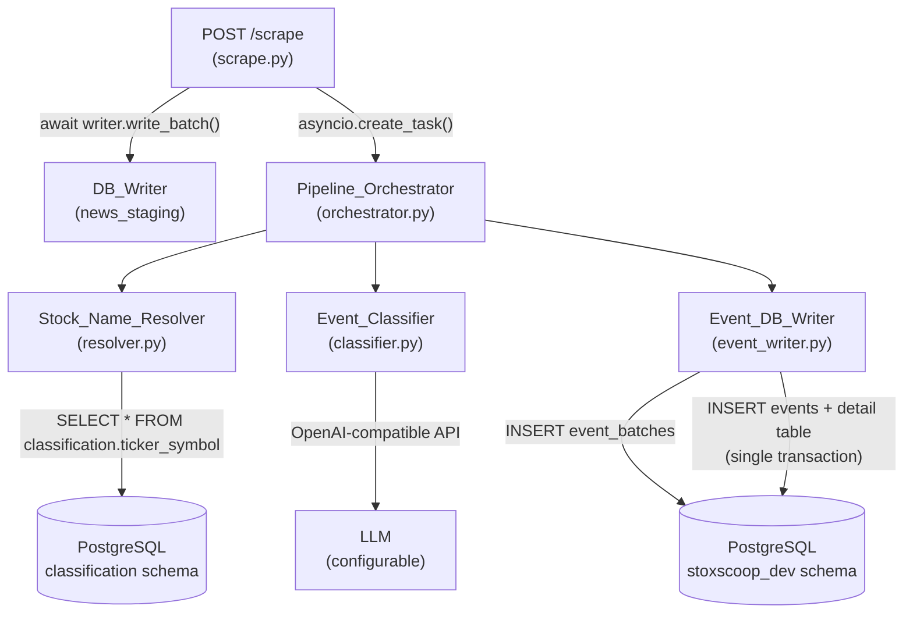

# Design Document: Event Classification Pipeline

## Overview

The event classification pipeline is Phase 3 of the MoneyControl stocks scraper project. It consumes `OutputRecord` objects produced by the existing scrape endpoint, resolves each scraped stock name to a `classification.ticker_symbol` row, sends the news text to an LLM for structured event classification, and persists the result to the `stoxscoop_dev` event tables.

The pipeline runs as an asyncio background task, so the `POST /scrape` HTTP response is returned to the client immediately while classification proceeds in the background. It is composed of four modules under `app/pipeline/`:

- `resolver.py` — `Stock_Name_Resolver`: fuzzy-matches scraped stock names to ticker IDs
- `classifier.py` — `Event_Classifier`: calls the LLM and validates the structured response
- `event_writer.py` — `Event_DB_Writer`: persists events and detail rows to PostgreSQL
- `orchestrator.py` — `Pipeline_Orchestrator`: coordinates the three components and integrates with `scrape.py`

### Key Design Decisions

1. **Async background task**: The orchestrator is fired with `asyncio.create_task()` from `scrape.py` after `news_staging` insertion, keeping HTTP latency unaffected by LLM call time.
2. **OpenAI-compatible LLM API**: The classifier uses the `openai` Python SDK with configurable `LLM_BASE_URL`, `LLM_MODEL`, and `LLM_API_KEY` from `.env`, allowing any OpenAI-compatible provider (OpenAI, Ollama, vLLM, etc.).
3. **`rapidfuzz` for fuzzy matching**: `token_set_ratio` scoring handles word-order variation and partial name matches common in Indian stock names.
4. **Regex-based name normalisation**: A single compiled regex strips legal suffixes and punctuation before both exact and fuzzy matching.
5. **Idempotency via unique index + `ON CONFLICT DO NOTHING`**: Duplicate prevention is enforced at the database level, making re-runs safe without application-level pre-checks.
6. **Batch tracking**: An `event_batches` row is inserted at run start and updated at completion or failure, providing a full audit trail.

---

## Architecture



### Data Flow

1. `scrape.py` calls `DB_Writer.write_batch()` to insert `OutputRecord` objects into `news_staging`.
2. For each successfully inserted record, `scrape.py` fires `asyncio.create_task(orchestrator.run(record, schema, pool))`.
3. `Pipeline_Orchestrator.run()`:
   a. Calls `Event_DB_Writer.start_batch()` → inserts `event_batches` row, returns `batch_id`.
   b. Iterates over each `(section_name, stock_name, news_text)` triple in the `OutputRecord`.
   c. Calls `Stock_Name_Resolver.resolve(stock_name)` → returns `stock_id` or `None`.
   d. If resolved, calls `Event_Classifier.classify(news_text, section_name)` → returns `ClassificationResult`.
   e. If classified, calls `Event_DB_Writer.write_event(batch_id, stock_id, result, record)`.
   f. Calls `Event_DB_Writer.finish_batch(batch_id, inserted_count)` on completion or error.
4. `scrape.py` returns `ScrapeResponse` with `events_queued` set to the total stock entry count.

---

## Components and Interfaces

### `app/pipeline/resolver.py` — `Stock_Name_Resolver`

```python
class Stock_Name_Resolver:
    def __init__(self, pool: asyncpg.Pool, schema: str) -> None: ...

    async def load_cache(self) -> None:
        """Load all rows from classification.ticker_symbol into memory.
        Raises RuntimeError on DB failure (halts pipeline)."""

    def normalise(self, name: str) -> str:
        """Pure function: lowercase → strip punctuation → strip legal suffixes
        → collapse whitespace → strip. Returns empty string for null/empty input."""

    def resolve(self, scraped_name: str) -> int | None:
        """Return ticker_symbol.id or None (Unresolved).
        1. Normalise scraped_name.
        2. Exact match: short_name → trading_symbol → name (all normalised).
        3. Fuzzy match (token_set_ratio ≥ 80) against active records only.
        4. Return None and log warning if unresolved."""
```

**Legal suffixes stripped** (applied after lowercase, before punctuation removal):
`limited`, `ltd`, `industries`, `inc`, `corp`

**Fuzzy matching**: `rapidfuzz.fuzz.token_set_ratio` against `short_name` and `name` columns of active records (`is_active = true`). Threshold: 80. Tie-break: lowest `id`.

---

### `app/pipeline/classifier.py` — `Event_Classifier`

```python
class Event_Classifier:
    def __init__(self, valid_subtypes: dict[str, set[str]]) -> None:
        """valid_subtypes: {event_type: {subtype_code, ...}} loaded from event_subtypes table."""

    async def classify(
        self,
        news_text: str,
        section_name: str,
        stock_name: str,
    ) -> ClassificationResult: ...
```

**`ClassificationResult` dataclass**:

```python
@dataclass
class ClassificationResult:
    status: Literal["ok", "unclassified", "failed"]
    event_type: str | None
    event_subtype: str | None
    signal_type: str | None
    sentiment: str | None
    priority: str | None
    title: str | None          # truncated to 500 chars
    summary: str | None
    event_date: str | None     # ISO 8601 YYYY-MM-DD or None
    confidence_score: Decimal | None   # numeric(4,3) or None
    confidence_model_version: str | None
    details: dict              # {} when absent/invalid
    tags: list[str]
    signal_reason: str | None
```

**LLM integration**:
- Uses `openai.AsyncOpenAI(base_url=LLM_BASE_URL, api_key=LLM_API_KEY)`.
- Model: `LLM_MODEL` from `.env`.
- Timeout: 30 seconds per attempt; up to 3 attempts with 2-second delay.
- `response_format={"type": "json_object"}` to enforce JSON output.
- Invalid JSON → `status="failed"`, no retry.
- Network/timeout error → retry up to 2 times; all fail → `status="failed"`.

**LLM prompt structure** (system + user):

```
SYSTEM:
You are a financial event classifier for Indian stock market news.
Classify the provided news text into a structured JSON event record.

Return ONLY a valid JSON object with these fields:
  event_type: one of [corporate_action, disclosure, insider, business,
               governance, credit_rating, financials, fundraising, legal]
  event_subtype: valid subtype_code for the event_type (see reference below)
  signal_type: one of [bullish, bearish, neutral, mixed]
  sentiment: one of [positive, negative, neutral, mixed]
  priority: one of [low, medium, high, critical]
  title: concise title (max 500 chars)
  summary: 1-2 sentence summary
  event_date: ISO 8601 date (YYYY-MM-DD) or null
  confidence_score: float in [0.0, 1.0]
  tags: list of relevant string tags
  signal_reason: brief rationale for signal_type
  details: object with fields specific to the event_type (see schema below)

[event_subtypes reference table — all valid (event_type, subtype_code) pairs]
[detail field schema for each event_type]

USER:
Section: {section_name}
{bulk/block deal hint if applicable}
Stock: {stock_name}
News: {news_text}
```

**Section hint logic**: If `section_name.lower()` contains `"bulk deal"` → add hint for `disclosure/bulk_deal`. If contains `"block deal"` → add hint for `disclosure/block_deal`. Both hints are included when both patterns match.

---

### `app/pipeline/event_writer.py` — `Event_DB_Writer`

```python
class Event_DB_Writer:
    def __init__(self, pool: asyncpg.Pool, schema: str) -> None: ...

    async def start_batch(self, batch_name: str) -> int:
        """INSERT into event_batches; return batch_id. Raises on failure."""

    async def finish_batch(self, batch_id: int, total_events: int) -> None:
        """UPDATE event_batches SET completed_at, total_events. Logs on failure, does not raise."""

    async def write_event(
        self,
        batch_id: int,
        stock_id: int,
        result: ClassificationResult,
        record: OutputRecord,
        source_url: str,
    ) -> bool:
        """Insert events row + detail row in a single transaction.
        Returns True on success, False on skip (duplicate) or failure.
        Uses ON CONFLICT DO NOTHING for idempotency."""
```

**Event type → detail table mapping**:

| `event_type`      | Detail table                    |
|-------------------|---------------------------------|
| `business`        | `business_event_details`        |
| `corporate_action`| `corporate_action_details`      |
| `credit_rating`   | `credit_rating_details`         |
| `disclosure`      | `disclosure_details`            |
| `financials`      | `financial_result_details`      |
| `fundraising`     | `fundraising_details`           |
| `governance`      | `governance_details`            |
| `insider`         | `insider_details`               |
| `legal`           | `legal_details`                 |

**Idempotency**: A unique index on `events(stock_id, source_url, event_type, event_subtype, event_date)` (with `NULLS NOT DISTINCT` for `source_url`) enables `INSERT ... ON CONFLICT DO NOTHING`. The application checks the affected row count; 0 rows → log info and return `False`.

---

### `app/pipeline/orchestrator.py` — `Pipeline_Orchestrator`

```python
class Pipeline_Orchestrator:
    def __init__(
        self,
        resolver: Stock_Name_Resolver,
        classifier: Event_Classifier,
        writer: Event_DB_Writer,
    ) -> None: ...

    async def run(self, record: OutputRecord, batch_name: str) -> PipelineSummary: ...
```

**`PipelineSummary` dataclass**:

```python
@dataclass
class PipelineSummary:
    total: int
    resolved: int
    unresolved: int
    classified: int
    classification_failures: int
    db_inserted: int
    db_failures: int
```

---

## Data Models

### Environment Variables (`.env` additions)

| Variable        | Description                                      | Example                          |
|-----------------|--------------------------------------------------|----------------------------------|
| `LLM_MODEL`     | Model identifier passed to the API               | `gpt-4o-mini`                    |
| `LLM_API_KEY`   | API key for the LLM provider                     | `sk-...`                         |
| `LLM_BASE_URL`  | Base URL for OpenAI-compatible endpoint          | `https://api.openai.com/v1`      |

### `ClassificationResult` (internal dataclass — see classifier.py above)

### `PipelineSummary` (internal dataclass — see orchestrator.py above)

### Database: `events` unique index for idempotency

```sql
CREATE UNIQUE INDEX IF NOT EXISTS uq_events_idempotency
ON stoxscoop_dev.events (stock_id, event_type, event_subtype, event_date, source_url)
NULLS NOT DISTINCT;
```

`NULLS NOT DISTINCT` (PostgreSQL 15+) ensures two rows with `source_url = NULL` and matching other fields are treated as duplicates. For PostgreSQL < 15, a partial index or coalesce approach is used instead.

### `ScrapeResponse` schema update

```python
class ScrapeResponse(BaseModel):
    processed: int
    inserted: int
    skipped: int
    failures: list[dict]
    events_queued: int   # NEW: total stock entries submitted to pipeline
```

### Stock entry iteration

Each `OutputRecord.sections` is a `dict[section_name, dict[stock_name, news_text]]`. The orchestrator iterates as:

```python
for section_name, stocks in record.sections.items():
    for stock_name, news_text in stocks.items():
        # process (section_name, stock_name, news_text)
```

### `event_batches` batch name format

`moneycontrol_<YYYY-MM-DD_HH-MM-SS>` using UTC timestamp at run start, e.g. `moneycontrol_2026-05-31_10-45-00`.

---

## Correctness Properties

*A property is a characteristic or behavior that should hold true across all valid executions of a system — essentially, a formal statement about what the system should do. Properties serve as the bridge between human-readable specifications and machine-verifiable correctness guarantees.*

### Property 1: Name normalisation invariants

*For any* input string, `Stock_Name_Resolver.normalise(s)` SHALL return a string that: (a) contains only lowercase characters, (b) contains no punctuation characters, (c) contains none of the legal suffixes (`limited`, `ltd`, `industries`, `inc`, `corp`) as standalone tokens, (d) has no leading or trailing whitespace, and (e) contains no consecutive whitespace characters.

**Validates: Requirements 1.1**

---

### Property 2: Fuzzy match threshold enforcement

*For any* query string and any mock ticker cache, if `Stock_Name_Resolver.resolve()` returns a non-None `stock_id`, then the `token_set_ratio` score between the normalised query and the normalised name of the returned candidate SHALL be ≥ 80; and if the returned candidate is not the only candidate above the threshold, it SHALL have the lowest `id` among all candidates with the maximum score.

**Validates: Requirements 1.4**

---

### Property 3: Exact match column priority

*For any* mock ticker cache where the same normalised name appears in multiple columns (`short_name`, `trading_symbol`, `name`) of different rows, `Stock_Name_Resolver.resolve()` SHALL always return the `id` of the row matched via `short_name` first, then `trading_symbol`, then `name`.

**Validates: Requirements 1.3**

---

### Property 4: LLM prompt completeness

*For any* stock news text and section name, the prompt constructed by `Event_Classifier.classify()` SHALL contain all nine required top-level JSON field names (`event_type`, `event_subtype`, `signal_type`, `sentiment`, `priority`, `title`, `summary`, `event_date`, `confidence_score`) and the section name.

**Validates: Requirements 2.1, 8.3**

---

### Property 5: Detail field prompt completeness

*For any* of the nine recognised `event_type` values, the LLM prompt constructed by `Event_Classifier` SHALL contain all required detail field names specified for that event type in Requirements 3.1–3.9.

**Validates: Requirements 3.1, 3.2, 3.3, 3.4, 3.5, 3.6, 3.7, 3.8, 3.9**

---

### Property 6: Confidence score range validation

*For any* `confidence_score` value returned by the LLM, if the value is outside the range [0.000, 1.000] or is absent, then `ClassificationResult.confidence_score` SHALL be `None` AND `ClassificationResult.confidence_model_version` SHALL also be `None`; if the value is within [0.000, 1.000] and a model identifier is present, both fields SHALL be non-null.

**Validates: Requirements 2.5, 2.8**

---

### Property 7: Title length invariant

*For any* title string returned by the LLM, `ClassificationResult.title` SHALL have length ≤ 500 characters after processing.

**Validates: Requirements 2.10**

---

### Property 8: Event type → detail table mapping correctness

*For any* of the nine recognised `event_type` values, `Event_DB_Writer._detail_table(event_type)` SHALL return the exact detail table name specified in the mapping (Requirements 5.2), and the mapping SHALL be total (no recognised type returns `None`).

**Validates: Requirements 5.2**

---

### Property 9: source_name invariant

*For any* `ClassificationResult` written by `Event_DB_Writer.write_event()`, the `source_name` field in the constructed `events` INSERT statement SHALL always be `'moneycontrol'`.

**Validates: Requirements 5.5**

---

### Property 10: Idempotency — duplicate events are not inserted

*For any* event row already present in `stoxscoop_dev.events`, attempting to insert a row with the same `(stock_id, source_url, event_type, event_subtype, event_date)` SHALL result in no new row being added (row count unchanged), and `write_event()` SHALL return `False`.

**Validates: Requirements 9.1, 9.2, 9.3**

---

### Property 11: Pipeline summary completeness

*For any* pipeline run over N stock entries, `PipelineSummary` SHALL contain all seven count fields (`total`, `resolved`, `unresolved`, `classified`, `classification_failures`, `db_inserted`, `db_failures`), and `resolved + unresolved == total` and `classified + classification_failures + unresolved == total` and `db_inserted + db_failures ≤ classified`.

**Validates: Requirements 6.4**

---

### Property 12: Bulk/block deal section hint inclusion

*For any* section name whose lowercase form contains `"bulk deal"` or `"block deal"`, the LLM prompt constructed by `Event_Classifier` SHALL contain the corresponding hint subtype string (`bulk_deal` or `block_deal`).

**Validates: Requirements 8.1**

---

### Property 13: events_queued count correctness

*For any* set of `OutputRecord` objects successfully inserted into `news_staging`, `ScrapeResponse.events_queued` SHALL equal the sum of the total number of stock entries (leaf keys) across all inserted records' `sections` dicts.

**Validates: Requirements 7.3**

---

## Error Handling

### `Stock_Name_Resolver`

| Condition | Behaviour |
|-----------|-----------|
| DB query fails on `load_cache()` | Raise `RuntimeError("Failed to load ticker cache: {reason}")` — halts pipeline |
| `scraped_name` is `None` or normalises to `""` | Return `None`; log `WARNING: Unresolved stock '{name}': empty after normalisation` |
| No fuzzy candidate ≥ 80% | Return `None`; log `WARNING: Unresolved stock '{name}': best candidate '{candidate}' score={score}` |

### `Event_Classifier`

| Condition | Behaviour |
|-----------|-----------|
| LLM network/timeout error (attempt 1–2) | Retry after 2s |
| LLM network/timeout error (attempt 3) | Set `status="failed"`; log `ERROR: LLM failed for '{stock_name}': {reason}` |
| LLM returns invalid JSON | Set `status="failed"` immediately; log raw response; no retry |
| Invalid `(event_type, event_subtype)` pair | Set `status="unclassified"`, null out type/subtype/confidence fields; log `WARNING` |
| `confidence_score` out of range or absent | Set `confidence_score=None`, `confidence_model_version=None` |
| `title` > 500 chars | Truncate to 500 chars |
| `details` absent/not object/no recognisable fields | Set `details={}`; log `WARNING` |

### `Event_DB_Writer`

| Condition | Behaviour |
|-----------|-----------|
| `start_batch()` INSERT fails | Raise `RuntimeError("Failed to create event batch: {reason}")` — halts pipeline |
| `finish_batch()` UPDATE fails | Log `ERROR: Failed to update batch {batch_id}: {reason}`; do not re-raise |
| `write_event()` transaction fails | Rollback; log `ERROR` with stock name, batch_id, event type, reason; return `False`; continue |
| `ON CONFLICT DO NOTHING` (duplicate) | Log `INFO: Duplicate skipped: stock_id={id} url={url} type={type} subtype={subtype} date={date}`; return `False` |
| Unrecognised `event_type` | Skip insertion; log `WARNING`; return `False` |
| `confidence_score` not null but `confidence_model_version` null | Set both to `None` before INSERT |

### `Pipeline_Orchestrator`

| Condition | Behaviour |
|-----------|-----------|
| `Stock_Name_Resolver.load_cache()` raises | Re-raise; `scrape.py` catches, logs at ERROR, suppresses to HTTP client |
| Stock entry is Unresolved | Skip classification and DB write; log `WARNING` with stock name, URL, reason |
| `Event_Classifier` returns `status="failed"` | Skip DB write; log `ERROR` with stock name, URL, reason |
| `Event_DB_Writer.write_event()` returns `False` | Continue to next entry |
| Unhandled exception in `run()` | Propagates to `asyncio.create_task` exception handler in `scrape.py` |

### `scrape.py` integration

| Condition | Behaviour |
|-----------|-----------|
| Pipeline background task raises | Log `ERROR`; suppress; `events_queued` set to 0 for unsubmitted records |
| `output_mode == "file"` | Pipeline not invoked; `events_queued = 0` |

---

## Testing Strategy

### Unit Tests

Unit tests cover specific examples, edge cases, and pure-function behaviour. They use `pytest` with `unittest.mock` for DB and LLM mocking.

**`resolver.py`**:
- `normalise()` with various inputs: mixed case, punctuation, legal suffixes, extra whitespace, null, empty string, suffix-only strings
- `resolve()` exact match: priority order (short_name wins over trading_symbol wins over name)
- `resolve()` fuzzy match: returns highest-scoring active candidate; inactive records excluded
- `resolve()` tie-break: lowest `id` returned when scores are equal
- `resolve()` below threshold: returns `None`
- `load_cache()` DB failure: raises `RuntimeError`

**`classifier.py`**:
- LLM retry: 3 failures → `status="failed"`; 2 failures then success → `status="ok"`
- Invalid JSON response → `status="failed"`, no retry
- Invalid `(event_type, event_subtype)` pair → `status="unclassified"`
- `confidence_score` out of range → both confidence fields nulled
- Title truncation at exactly 500 chars
- Absent/invalid `details` → `details={}`
- Section hint: bulk deal section → hint in prompt; non-bulk section → no hint

**`event_writer.py`**:
- `start_batch()` success: returns correct `batch_id`
- `start_batch()` failure: raises `RuntimeError`
- `finish_batch()` failure: logs error, does not raise
- `write_event()` success: returns `True`
- `write_event()` duplicate (0 rows affected): returns `False`, logs info
- `write_event()` transaction failure: rollback, returns `False`, logs error
- Unrecognised `event_type`: returns `False`, logs warning
- `confidence_score` not null + `confidence_model_version` null: both set to null

**`orchestrator.py`**:
- Full happy path: resolver → classifier → writer all succeed
- Unresolved stock: classifier and writer not called
- Classifier failure: writer not called
- Writer failure: continues to next entry
- Summary counts are correct for mixed outcomes

### Property-Based Tests

Property-based tests use **Hypothesis** (Python). Each test runs a minimum of **100 iterations**.

Tag format: `# Feature: event-classification-pipeline, Property {N}: {property_text}`

**Property 1 — Name normalisation invariants**
```python
@given(st.text())
@settings(max_examples=500)
def test_normalise_invariants(name):
    # Feature: event-classification-pipeline, Property 1: normalise invariants
    result = resolver.normalise(name)
    assert result == result.lower()
    assert not any(c in string.punctuation for c in result)
    for suffix in LEGAL_SUFFIXES:
        assert f" {suffix}" not in f" {result} "
    assert result == result.strip()
    assert "  " not in result
```

**Property 2 — Fuzzy match threshold enforcement**
```python
@given(st.text(min_size=1), st.lists(ticker_strategy(), min_size=1))
@settings(max_examples=200)
def test_fuzzy_threshold(query, tickers):
    # Feature: event-classification-pipeline, Property 2: fuzzy threshold ≥ 80
    r = Stock_Name_Resolver.__new__(Stock_Name_Resolver)
    r._cache = tickers
    result_id = r.resolve(query)
    if result_id is not None:
        matched = next(t for t in tickers if t["id"] == result_id)
        score = token_set_ratio(r.normalise(query), r.normalise(matched["short_name"] or ""))
        assert score >= 80
```

**Property 3 — Exact match column priority**
```python
@given(normalised_name_strategy())
@settings(max_examples=200)
def test_exact_match_priority(norm_name):
    # Feature: event-classification-pipeline, Property 3: column priority
    # Build cache where same normalised name appears in short_name, trading_symbol, name
    # of different rows; verify short_name row is always returned
    ...
```

**Property 4 — LLM prompt completeness**
```python
@given(st.text(min_size=1), st.text(min_size=1))
@settings(max_examples=200)
def test_prompt_contains_required_fields(news_text, section_name):
    # Feature: event-classification-pipeline, Property 4: prompt completeness
    prompt = classifier._build_prompt(news_text, section_name, "TestStock")
    for field in REQUIRED_FIELDS:
        assert field in prompt
    assert section_name in prompt
```

**Property 5 — Detail field prompt completeness**
```python
@given(st.sampled_from(list(DETAIL_FIELDS.keys())))
@settings(max_examples=100)
def test_detail_fields_in_prompt(event_type):
    # Feature: event-classification-pipeline, Property 5: detail fields in prompt
    prompt = classifier._build_prompt("text", "section", "stock", hint_event_type=event_type)
    for field in DETAIL_FIELDS[event_type]:
        assert field in prompt
```

**Property 6 — Confidence score range validation**
```python
@given(st.floats(allow_nan=True, allow_infinity=True) | st.none())
@settings(max_examples=500)
def test_confidence_score_validation(score):
    # Feature: event-classification-pipeline, Property 6: confidence range
    result = classifier._validate_confidence(score, "model-v1")
    if score is not None and 0.0 <= score <= 1.0:
        assert result[0] is not None and result[1] is not None
    else:
        assert result[0] is None and result[1] is None
```

**Property 7 — Title length invariant**
```python
@given(st.text())
@settings(max_examples=500)
def test_title_truncation(title):
    # Feature: event-classification-pipeline, Property 7: title ≤ 500 chars
    result = classifier._process_title(title)
    assert len(result) <= 500
```

**Property 8 — Event type → detail table mapping**
```python
@given(st.sampled_from(RECOGNISED_EVENT_TYPES))
@settings(max_examples=100)
def test_detail_table_mapping(event_type):
    # Feature: event-classification-pipeline, Property 8: detail table mapping
    table = Event_DB_Writer._detail_table(event_type)
    assert table == EXPECTED_MAPPING[event_type]
    assert table is not None
```

**Property 9 — source_name invariant**
```python
@given(classification_result_strategy())
@settings(max_examples=200)
def test_source_name_always_moneycontrol(result):
    # Feature: event-classification-pipeline, Property 9: source_name invariant
    params = writer._build_event_params(result, stock_id=1, batch_id=1, source_url="http://x.com")
    assert params["source_name"] == "moneycontrol"
```

**Property 10 — Idempotency**
```python
@given(event_row_strategy())
@settings(max_examples=100)
async def test_idempotency(event_row):
    # Feature: event-classification-pipeline, Property 10: idempotency
    # Insert once → success; insert again → ON CONFLICT DO NOTHING → 0 rows
    ...
```

**Property 11 — Pipeline summary completeness**
```python
@given(pipeline_run_strategy())
@settings(max_examples=200)
async def test_summary_completeness(run_config):
    # Feature: event-classification-pipeline, Property 11: summary completeness
    summary = await orchestrator.run(run_config.record, "batch")
    assert summary.resolved + summary.unresolved == summary.total
    assert summary.classified + summary.classification_failures + summary.unresolved == summary.total
    assert summary.db_inserted + summary.db_failures <= summary.classified
```

**Property 12 — Bulk/block deal hint inclusion**
```python
@given(bulk_block_section_name_strategy())
@settings(max_examples=200)
def test_bulk_block_hint_in_prompt(section_name):
    # Feature: event-classification-pipeline, Property 12: bulk/block hint
    prompt = classifier._build_prompt("text", section_name, "stock")
    lower = section_name.lower()
    if "bulk deal" in lower:
        assert "bulk_deal" in prompt
    if "block deal" in lower:
        assert "block_deal" in prompt
```

**Property 13 — events_queued count correctness**
```python
@given(st.lists(output_record_strategy(), min_size=0, max_size=10))
@settings(max_examples=200)
def test_events_queued_count(records):
    # Feature: event-classification-pipeline, Property 13: events_queued count
    expected = sum(
        len(stocks)
        for record in records
        for stocks in record.sections.values()
    )
    response = build_scrape_response(records)
    assert response.events_queued == expected
```
