# Design Document: LLM Provider Fallback

## Overview

The `LLM_Provider_Manager` component adds multi-provider fallback and rotation to the existing
`Event_Classifier` pipeline. It wraps provider configuration, runtime state tracking, and fallback
logic in a single injectable object that `Event_Classifier` accepts via constructor injection.

The design is intentionally narrow: `Event_Classifier.classify()` is not changed, no call sites
in `scrape.py`, `classify.py`, or the orchestrator need to be touched. A no-argument construction
of `Event_Classifier` continues to work exactly as it does today.

### Key Goals

- Transparent fallback: callers see only the final `ClassificationResult`, never a provider-switch
  event.
- Backward compatibility: existing single-provider env-var configuration keeps working with zero
  config changes.
- Deterministic selection: the two rotation strategies (`priority` and `round-robin`) have clear,
  testable definitions.
- No external dependencies beyond what the project already uses (`pyyaml`, `openai`).

---

## Architecture

```mermaid
graph TD
    subgraph FastAPI App
        S[scrape.py / classify.py routers]
    end

    subgraph Pipeline
        EC[Event_Classifier]
        PM[LLM_Provider_Manager]
    end

    subgraph Config
        CF[config.yaml\nllm_providers + llm_rotation_strategy]
    end

    subgraph LLM APIs
        P1[Provider 1\nGemini Free]
        P2[Provider 2\nOpenRouter]
        P3[Provider N\n...]
    end

    S -->|construct| EC
    EC -->|constructor injection\nor auto-init| PM
    CF -->|loaded at startup| PM
    PM -->|get_available_provider()| EC
    EC -->|openai.AsyncOpenAI| P1
    EC -->|fallback| P2
    EC -->|fallback| P3
```

The `LLM_Provider_Manager` is constructed once (either explicitly in application startup code or
lazily inside `Event_Classifier.__init__`). The classifier calls `get_available_provider()` before
every LLM request and calls `record_error()` when a quota or rate-limit error is received.
`_parse_retry_delay()` moves from `classifier.py` into `provider_manager.py` where it is used to
compute the `rate_limited` retry-after timestamp.

### State Transition Diagram

```mermaid
stateDiagram-v2
    [*] --> available : startup / reset

    available --> rate_limited : RateLimitError\n(parseable retry-after ≥ 1s)
    available --> quota_exhausted : QuotaError\nOR RateLimitError\n(no parseable delay)

    rate_limited --> available : retry-after datetime passed\n(lazy re-check on next selection)
    rate_limited --> quota_exhausted : explicit reset not used;\nalready in rate_limited\n(stays rate_limited unless reset)

    quota_exhausted --> available : reset_provider(name)\nor reset_all_providers()
```



---

## Components and Interfaces

### `ProviderConfig` (dataclass)

Holds immutable configuration for a single provider, parsed from `config.yaml` or derived from
env vars.

```python
@dataclass(frozen=True)
class ProviderConfig:
    name: str          # unique identifier, case-sensitive
    base_url: str
    api_key: str       # resolved value (env var reference already substituted)
    model: str
    weight: int = 1    # positive integer; reserved for future weighted round-robin
```

### `ProviderState` (enum)

```python
class ProviderState(enum.Enum):
    AVAILABLE = "available"
    RATE_LIMITED = "rate_limited"
    QUOTA_EXHAUSTED = "quota_exhausted"
```

### `_ProviderRuntime` (internal dataclass)

Holds mutable runtime state for a single provider. Not exposed outside `provider_manager.py`.

```python
@dataclass
class _ProviderRuntime:
    config: ProviderConfig
    state: ProviderState = ProviderState.AVAILABLE
    retry_after: datetime | None = None  # only set when state == RATE_LIMITED
```

### `ConfigurationError` (exception)

```python
class ConfigurationError(Exception):
    """Raised for invalid or incomplete LLM provider configuration."""
```

### `LLM_Provider_Manager`

```python
class LLM_Provider_Manager:
    # Construction
    def __init__(
        self,
        providers: list[ProviderConfig],
        strategy: Literal["priority", "round-robin"] = "priority",
    ) -> None: ...

    # Factory — builds from a raw config dict (the value of config["llm_providers"])
    @classmethod
    def from_config(cls, config: dict) -> "LLM_Provider_Manager": ...

    # Provider selection
    def get_available_provider(self) -> ProviderConfig | None:
        """Return the next provider to use, or None if all are unavailable.

        Side effect: lazily re-enables rate_limited providers whose retry-after
        has passed. Advances the round-robin pointer after successful selection
        only when strategy == "round-robin".
        """

    # Error recording
    def record_quota_error(self, name: str) -> None:
        """Transition named provider to quota_exhausted."""

    def record_rate_limit_error(self, name: str, error_text: str) -> None:
        """Transition named provider to rate_limited (or quota_exhausted if
        no parseable retry-after delay ≥ 1 second is found in error_text)."""

    # Introspection
    def get_provider_configs(self) -> list[ProviderConfig]:
        """Return the parsed provider list in config-file order."""

    def get_provider_state(self, name: str) -> ProviderState:
        """Return the current state of the named provider."""

    # Runtime reset
    def reset_provider(self, name: str) -> None:
        """Reset named provider to available; raises ValueError if name unknown."""

    def reset_all_providers(self) -> None:
        """Reset all providers to available."""
```

### `Event_Classifier` changes

Only the `__init__` method and the `classify` method body change. The public signature of
`classify()` is **unchanged**.

```python
class Event_Classifier:
    def __init__(
        self,
        valid_subtypes: dict[str, set[str]],
        provider_manager: LLM_Provider_Manager | None = None,
    ) -> None:
        self._valid_subtypes = valid_subtypes
        if provider_manager is None:
            # Backward-compatible default: build from env vars
            provider_manager = _make_default_provider_manager()
        self._provider_manager = provider_manager
```

`_make_default_provider_manager()` is a module-level helper in `classifier.py` that reads
`LLM_BASE_URL`, `LLM_API_KEY`, `LLM_MODEL` from the environment and constructs a single-provider
`LLM_Provider_Manager`. This preserves the existing behaviour exactly.

---

## Data Models

### Config YAML Schema

```yaml
# config.yaml additions (all other existing keys remain unchanged)

llm_rotation_strategy: "priority"   # or "round-robin" — default: "priority"

llm_providers:
  - name: "gemini-free"
    base_url: "https://generativelanguage.googleapis.com/v1beta/openai/"
    api_key: "$GEMINI_API_KEY"       # resolved from env var GEMINI_API_KEY
    model: "gemini-2.0-flash"
    weight: 1                        # optional, default 1

  - name: "openrouter-llama"
    base_url: "https://openrouter.ai/api/v1"
    api_key: "$OPENROUTER_API_KEY"
    model: "meta-llama/llama-3.1-8b-instruct:free"
    weight: 1

  - name: "openrouter-gemma"
    base_url: "https://openrouter.ai/api/v1"
    api_key: "$OPENROUTER_API_KEY"
    model: "google/gemma-3-12b-it:free"
    weight: 1
```

**Validation rules (enforced in `LLM_Provider_Manager.from_config`):**

| Rule | Error |
|---|---|
| `name`, `base_url`, or `model` absent | `ConfigurationError` with field name + 1-based entry index |
| Duplicate `name` values | `ConfigurationError` with both 1-based indices |
| `api_key` starts with `$` and env var absent/empty | `ConfigurationError` with provider name + var name |
| `llm_rotation_strategy` not in `{"priority", "round-robin"}` | `ConfigurationError` |
| `weight` ≤ 0 (if provided) | `ConfigurationError` |

### Runtime State Model

```
providers: list[_ProviderRuntime]       # preserves config-file order
_rr_index: int                          # round-robin cursor (0-based index into providers list)
_strategy: Literal["priority", "round-robin"]
```

`_rr_index` starts at 0 and advances (wrapping) after each successful `get_available_provider()`
call when strategy is `round-robin`. It is not used by the `priority` strategy.

---

## Provider Selection Algorithm

### Priority Strategy

```
def get_available_provider() -> ProviderConfig | None:
    _recheck_rate_limits()      # lazily re-enable providers whose timer expired
    for runtime in self._providers:
        if runtime.state == AVAILABLE:
            return runtime.config
    return None
```

The pointer always starts from index 0. Skipping a non-available provider does not change any
state; the method simply continues to the next entry.

### Round-Robin Strategy

```
def get_available_provider() -> ProviderConfig | None:
    _recheck_rate_limits()
    n = len(self._providers)
    for offset in range(n):
        idx = (self._rr_index + offset) % n
        if self._providers[idx].state == AVAILABLE:
            self._rr_index = (idx + 1) % n   # advance past the chosen provider
            return self._providers[idx].config
    return None
```

The cursor advances **after** a provider is selected (not after a successful LLM call completes),
so each call starts from the next candidate regardless of whether the previous call succeeded or
failed downstream.

### Fallback Loop Inside `Event_Classifier.classify()`

The existing retry loop (3 attempts for network errors) is preserved and now wraps a provider
selection step:

```
async def classify(...) -> ClassificationResult:
    for _fallback in range(len(providers) + 1):   # bound the fallback loop
        provider = self._provider_manager.get_available_provider()
        if provider is None:
            logger.error("All providers exhausted ...")
            return ClassificationResult(status="failed", details={"reason": "all_providers_exhausted"}, ...)

        logger.debug("Using provider '%s' model '%s'", provider.name, provider.model)
        client = openai.AsyncOpenAI(base_url=provider.base_url, api_key=provider.api_key)

        try:
            # existing 3-attempt network retry loop ...
            # on RateLimitError: call record_rate_limit_error, break inner loop → outer fallback loop
            # on QuotaError:     call record_quota_error,      break inner loop → outer fallback loop
            # on success:        return _process_response(data, stock_name, provider.model)
        except openai.RateLimitError as exc:
            self._provider_manager.record_rate_limit_error(provider.name, str(exc))
            continue  # outer fallback loop: pick next provider
        except _QuotaExhaustedError as exc:
            self._provider_manager.record_quota_error(provider.name)
            continue
```

**Quota vs Rate-Limit detection:** The existing `openai.RateLimitError` handler in the classifier
currently retries within the same provider. With `LLM_Provider_Manager`, the logic becomes:

1. Parse the error message with `_parse_retry_delay()` (moved to `provider_manager.py`).
2. If a retry-after ≥ 1 s is found → `record_rate_limit_error(name, error_text)` → outer loop
   continues to next provider immediately (no sleep in the classifier; the rate-limited provider
   is automatically skipped by state).
3. If no parseable delay → `record_quota_error(name)` → outer loop continues.

This means the classifier no longer sleeps on rate-limit errors; sleeping would block other
requests. Instead the provider is parked as `rate_limited` with its expiry timestamp and other
providers are tried.

---

## Migration of `_parse_retry_delay`

`_parse_retry_delay` is moved from `classifier.py` to `provider_manager.py` as a module-level
private function. A thin re-export shim stays in `classifier.py` for the duration of any tests
that import it directly, but all new usage goes through `provider_manager.py`.

```python
# provider_manager.py
_RETRY_DELAY_RE = re.compile(r"retry[^\d]*(\d+(?:\.\d+)?)\s*s", re.IGNORECASE)

def _parse_retry_delay(error_text: str) -> float | None:
    """Return retry seconds parsed from a 429 message, or None if not parseable."""
    m = _RETRY_DELAY_RE.search(error_text)
    if m:
        try:
            return float(m.group(1)) + 1.0   # +1s buffer, same as original
        except ValueError:
            pass
    return None
```

The return type changes from `float` (with a default) to `float | None` so callers can
distinguish "found a delay" from "no delay". The `default` parameter is dropped; callers in the
manager handle the `None` case explicitly (transition to `quota_exhausted`).

---

## File Structure

### New Files

| File | Purpose |
|---|---|
| `app/pipeline/provider_manager.py` | `LLM_Provider_Manager`, `ProviderConfig`, `ProviderState`, `ConfigurationError`, `_parse_retry_delay` |
| `tests/pipeline/test_provider_manager.py` | Unit + property-based tests for `LLM_Provider_Manager` |

### Modified Files

| File | Changes |
|---|---|
| `app/pipeline/classifier.py` | Add optional `provider_manager` param to `__init__`; refactor `classify()` to use it; move `_parse_retry_delay` (keep shim); add `_make_default_provider_manager()` helper |
| `config.yaml` | Document new `llm_providers` and `llm_rotation_strategy` keys (commented examples) |
| `pyproject.toml` | No new dependencies needed (`hypothesis` already in dev extras) |

### Unchanged Files

All routers (`scrape.py`, `classify.py`), the orchestrator, the event writer, the resolver — none
of these need to change. The `Event_Classifier` constructor call in `scrape.py` adds no new
arguments (the manager is built internally using env vars when not supplied).

---

## Correctness Properties

*A property is a characteristic or behavior that should hold true across all valid executions of a
system — essentially, a formal statement about what the system should do. Properties serve as the
bridge between human-readable specifications and machine-verifiable correctness guarantees.*

The rotation logic, state transitions, and config parsing are all pure or near-pure functions over
well-defined input spaces. Property-based testing with [Hypothesis](https://hypothesis.readthedocs.io)
is appropriate here: the behavior must hold for any valid provider list, any provider state
combination, and any numeric retry delay.

---

### Property 1: All providers initialise to `available`

*For any* non-empty list of valid `ProviderConfig` objects, constructing an `LLM_Provider_Manager`
SHALL result in every provider having `ProviderState.AVAILABLE`.

**Validates: Requirements 2.1**

---

### Property 2: Config parsing preserves order and field values (round-trip)

*For any* non-empty list of valid provider config dicts (each having non-empty `name`, `base_url`,
`model`, and resolved `api_key`), parsing them into `ProviderConfig` objects and then serialising
those objects back to dicts and parsing again SHALL produce a provider list with the same count,
order, and field values as the original.

**Validates: Requirements 6.2**

---

### Property 3: Priority strategy always selects the lowest-index available provider

*For any* non-empty list of providers and *any* subset of those providers marked as
`quota_exhausted` or `rate_limited`, `get_available_provider()` with strategy `priority` SHALL
return the provider with the lowest list index whose state is `AVAILABLE`, or `None` if all are
unavailable.

**Validates: Requirements 3.2**

---

### Property 4: Round-robin strategy advances the pointer in circular order

*For any* non-empty list of providers (all `AVAILABLE`) and *any* sequence of N calls to
`get_available_provider()` with strategy `round-robin`, the sequence of returned providers SHALL
cycle through the list in index order, wrapping around, with each provider selected in turn.

**Validates: Requirements 3.3**

---

### Property 5: Quota-exhausted provider is never selected until reset

*For any* provider list with at least two providers, after `record_quota_error(name)` is called
for provider P, *for any* number of subsequent `get_available_provider()` calls, provider P SHALL
NOT be returned until `reset_provider(name)` or `reset_all_providers()` is called.

**Validates: Requirements 2.2, 3.5**

---

### Property 6: Rate-limit with valid delay sets retry-after ≤ 24 hours from now

*For any* positive numeric retry-after delay extracted from an error message, the `retry_after`
datetime recorded by `record_rate_limit_error` SHALL be in the future and SHALL NOT exceed 24
hours from the time the call was made.

**Validates: Requirements 2.3**

---

### Property 7: All providers exhausted returns `None` from selection

*For any* non-empty provider list where every provider is in `quota_exhausted` or `rate_limited`
(with retry-after in the future) state, `get_available_provider()` SHALL return `None`.

**Validates: Requirements 2.5, 3.7**

---

### Property 8: `reset_provider` is idempotent for any initial state

*For any* provider in *any* state (`available`, `rate_limited`, `quota_exhausted`), calling
`reset_provider(name)` SHALL transition that provider to `AVAILABLE` with `retry_after = None`,
regardless of how many times it is called consecutively.

**Validates: Requirements 7.1, 7.4**

---

### Property 9: `reset_all_providers` leaves every provider available

*For any* non-empty provider list with *any* combination of provider states, calling
`reset_all_providers()` SHALL result in every provider having `ProviderState.AVAILABLE` and
`retry_after = None`.

**Validates: Requirements 7.2**

---

### Property 10: Duplicate provider names raise `ConfigurationError`

*For any* provider list containing two entries with identical `name` values (same case), calling
`LLM_Provider_Manager.from_config()` SHALL raise `ConfigurationError`.

**Validates: Requirements 6.4**

---

### Property 11: Missing required fields raise `ConfigurationError` with correct index

*For any* provider list where at least one entry is missing `name`, `base_url`, or `model`,
`LLM_Provider_Manager.from_config()` SHALL raise `ConfigurationError` that identifies the missing
field name and the correct 1-based index of the offending entry.

**Validates: Requirements 1.5**

---

## Error Handling

### `ConfigurationError`

Raised at startup (during `from_config()` or `_make_default_provider_manager()`) for invalid
configuration. The application should let this propagate — a misconfigured provider list is a
fatal startup error, not a recoverable runtime condition.

### `ValueError` from `reset_provider`

Raised synchronously when an unknown provider name is passed. The caller (e.g. an admin reset
endpoint) should catch this and return a 404/422 to the client.

### All-providers-exhausted

`get_available_provider()` returns `None`. The classifier converts this into a
`ClassificationResult(status="failed", details={"reason": "all_providers_exhausted"}, ...)`.
The pipeline continues processing other stock entries; only this one entry fails.

### LLM network errors

Connection and timeout errors still use the existing 3-attempt retry loop **within the same
provider** before giving up on that provider. Only quota/rate-limit errors trigger a provider
switch (fallback). This avoids switching providers for transient connectivity blips.

### Thread safety / async safety

All mutable state in `LLM_Provider_Manager` (`_providers`, `_rr_index`) is accessed from async
coroutines in a single asyncio event loop with no `await` inside the state-mutation methods. Since
asyncio is cooperative (no preemption between statements), no explicit lock is required. If the
manager is ever used from multiple threads, a `threading.Lock` should be added.

---

## Testing Strategy

### Unit Tests (`tests/pipeline/test_provider_manager.py`)

Example-based tests cover:
- `from_config()` with a minimal valid config dict → correct `ProviderConfig` fields
- `from_config()` with `api_key: "$MY_KEY"` → env var resolved
- `from_config()` with missing env var → `ConfigurationError`
- `from_config()` with missing `name` / `base_url` / `model` → `ConfigurationError` with correct field and index
- `from_config()` with `llm_rotation_strategy: "round-robin"` → strategy set correctly
- `record_quota_error` + `get_available_provider` skips the exhausted provider
- `record_rate_limit_error` with parseable delay → `RATE_LIMITED` state with correct `retry_after`
- `record_rate_limit_error` with no parseable delay → `QUOTA_EXHAUSTED`
- `reset_provider` with unknown name → `ValueError`
- Logging: WARNING on fallback, ERROR when all exhausted, INFO on re-enable (use `caplog`)
- No `api_key` value in any log output (provider `name` only)

### Property-Based Tests (`tests/pipeline/test_provider_manager.py`)

Uses [Hypothesis](https://hypothesis.readthedocs.io) (already in `dev` extras). Each property test
runs a minimum of 100 iterations.

```python
# Tag format used in each @given test:
# Feature: llm-provider-fallback, Property N: <property_text>
```

**Strategies (Hypothesis)**:
- `st.text(min_size=1)` for provider names, URLs, models
- `st.integers(min_value=1, max_value=86400 * 2)` for retry-after seconds
- `st.lists(provider_config_strategy(), min_size=1, max_size=10)` for provider lists
- `st.sampled_from(["priority", "round-robin"])` for strategies

Property tests implement:
- Property 1: All providers initialise to available
- Property 2: Config round-trip preserves order and fields
- Property 3: Priority always picks lowest-index available
- Property 4: Round-robin cycles in circular order
- Property 5: Quota-exhausted never selected until reset
- Property 6: Rate-limit retry-after is capped at 24 hours
- Property 7: All-exhausted returns None
- Property 8: reset_provider is idempotent
- Property 9: reset_all_providers leaves all available
- Property 10: Duplicate names raise ConfigurationError
- Property 11: Missing required fields raise ConfigurationError with correct index

### Integration / Modified Unit Tests

- `tests/pipeline/test_classifier.py`: existing tests continue to pass unchanged (the default
  constructor path is backward compatible). Add new tests:
  - `Event_Classifier` constructed with an injected `LLM_Provider_Manager` mock
  - When manager returns `None`, `classify()` returns `status="failed"` with
    `details={"reason": "all_providers_exhausted"}`
  - When first provider raises `RateLimitError`, manager is called with `record_rate_limit_error`,
    second provider is used, and a valid result is returned
