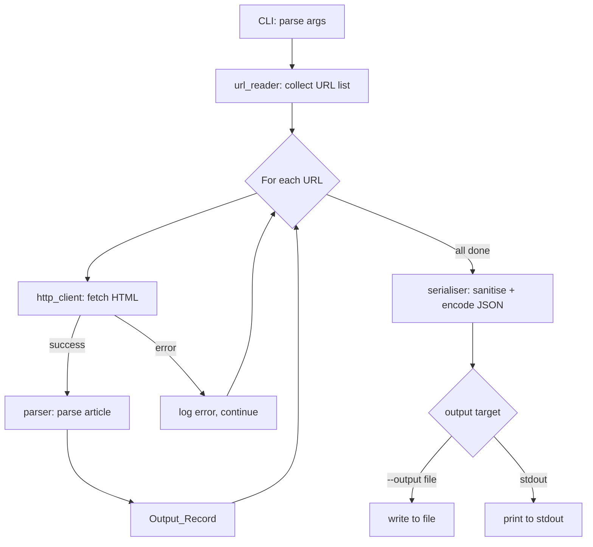
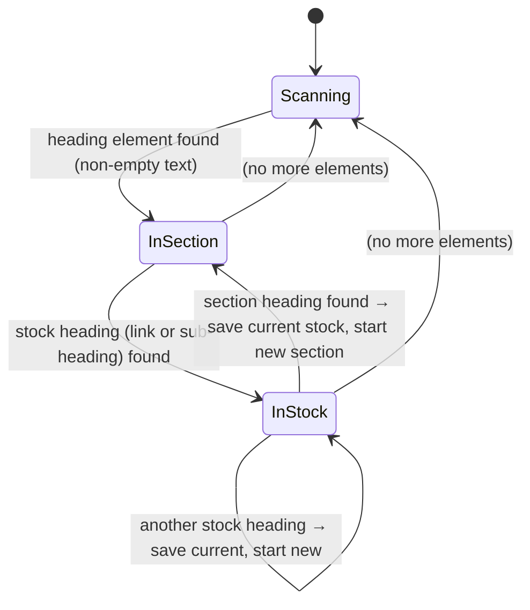

# Design Document

## Overview

The `moneycontrol-stocks-scraper` is a Python command-line tool that fetches and parses MoneyControl "Stocks to Watch" morning articles into structured JSON. Each article is a single web page containing named sections (e.g., "Stocks to Watch", "Bulk Deals") where each section lists stock names (as hyperlinks) paired with news paragraphs. The scraper accepts one or more article URLs, processes them sequentially, and emits a JSON array of `Output_Record` objects — one per URL.

The design is intentionally simple and dependency-light: `requests` for HTTP, `BeautifulSoup4` for HTML parsing, `argparse` for the CLI, and the standard `json` module for serialisation. No database, no async I/O, no external frameworks.

---

## Architecture

The scraper is structured as a single Python package with four clearly separated concerns:

```
moneycontrol_scraper/
├── __init__.py
├── http_client.py      # HTTP fetching (Requirement 1)
├── parser.py           # HTML parsing — sections, stocks, date (Requirements 2, 3, 4)
├── serialiser.py       # JSON output and UTF-8 sanitisation (Requirements 5, 8)
├── url_reader.py       # URL list reading from CLI args and --file (Requirements 6, 7)
└── cli.py              # argparse entry point (Requirement 7)
```

The main execution flow is:



Each URL is processed independently. A failure on one URL logs the error and moves on to the next, so a partial result set is always produced for the successfully fetched URLs.

---

## Components and Interfaces

### `http_client.py` — `HTTPClient`

Responsible for making HTTP GET requests and returning raw HTML.

```python
class HTTPClient:
    USER_AGENT = (
        "Mozilla/5.0 (Windows NT 10.0; Win64; x64) "
        "AppleWebKit/537.36 (KHTML, like Gecko) "
        "Chrome/124.0.0.0 Safari/537.36"
    )
    DEFAULT_TIMEOUT = 30  # seconds

    def fetch(self, url: str) -> str:
        """
        Fetch the HTML content of the given URL.

        Returns:
            The response body as a UTF-8 decoded string.

        Raises:
            ScraperFetchError: on non-200 status, network error, or timeout.
        """
```

- Sets `User-Agent` header on every request (Requirement 1.4).
- Raises `ScraperFetchError` (a custom exception subclassing `RuntimeError`) with a message containing the URL and failure reason for non-200 responses (1.2) and network/timeout errors (1.3).
- Timeout is fixed at 30 seconds (1.3).

### `parser.py` — `ArticleParser`

Responsible for extracting sections, stock entries, and the publication date from raw HTML.

```python
class ArticleParser:
    def parse(self, html: str, url: str) -> OutputRecord:
        """
        Parse a MoneyControl article page.

        Args:
            html: Raw HTML string of the article page.
            url:  The source URL (used for date fallback and warnings).

        Returns:
            An OutputRecord dataclass instance.
        """

    def _find_content_container(self, soup: BeautifulSoup) -> Tag:
        """Locate the primary article content div."""

    def _extract_sections(self, container: Tag) -> dict[str, dict[str, str]]:
        """Walk headings and paragraphs to build the sections dict."""

    def _extract_date(self, soup: BeautifulSoup, url: str) -> str | None:
        """
        Extract publication date. Priority order:
        1. JSON-LD datePublished
        2. <meta property="article:published_time"> or og:article:published_time
        3. <meta name="publish-date"> or similar visible date elements
        4. URL path pattern YYYY/MM/DD or YYYY-MM-DD
        5. None (with warning log)
        """
```

**Section extraction algorithm:**

The parser walks the children of the primary content container. It treats `h1`–`h6` tags and `strong`/`b` tags that are the sole non-whitespace child of a `p` or `div` as section headings. Within a section, it treats `a` tags (hyperlinks) inside sub-headings as stock name keys. Paragraphs between consecutive stock headings are concatenated with a single space as the stock's value.



**Date extraction priority:**

1. `<script type="application/ld+json">` — look for `datePublished` field in any JSON-LD block.
2. `<meta property="article:published_time">` or `<meta property="og:article:published_time">` — parse the `content` attribute.
3. `<meta name="publish-date">` or a visible `<time>` element with a `datetime` attribute.
4. Regex match on the URL path: `(\d{4})[/-](\d{2})[/-](\d{2})`.
5. Return `None` and emit a `logging.warning`.

All extracted dates are normalised to `YYYY-MM-DD` (ISO 8601 date-only format).

### `serialiser.py` — `Serialiser`

Responsible for UTF-8 sanitisation and JSON encoding.

```python
def sanitise_string(value: str) -> str:
    """
    Replace Unicode surrogate code points (U+D800–U+DFFF) and null bytes
    (U+0000) with the Unicode replacement character (U+FFFD).
    Returns empty string if the result still cannot be encoded as UTF-8.
    """

def serialise(records: list[OutputRecord]) -> str:
    """
    Serialise a list of OutputRecord objects to a JSON string (UTF-8,
    indent=2). Sanitises all string fields before encoding.
    """

def write_output(json_str: str, output_path: str | None) -> None:
    """
    Write json_str to output_path if given, otherwise print to stdout.
    Raises ScraperOutputError on unwritable path.
    """
```

### `url_reader.py` — `read_urls`

```python
def read_urls(positional_args: list[str], file_path: str | None) -> list[str]:
    """
    Collect URLs from positional CLI arguments and/or a --file path.
    File format: one URL per line; blank lines and lines starting with '#' ignored.
    Raises ScraperInputError if file_path is given but unreadable.
    """
```

### `cli.py` — entry point

```python
def build_parser() -> argparse.ArgumentParser:
    """Build and return the argparse parser."""

def main() -> None:
    """
    Parse CLI args, collect URLs, run scraper loop, serialise, write output.
    Exits with code 1 on fatal errors (no URLs, unreadable file, unwritable output).
    """
```

### Custom Exceptions

```python
class ScraperError(RuntimeError): ...
class ScraperFetchError(ScraperError): ...   # HTTP / network failures
class ScraperInputError(ScraperError): ...   # bad --file path, no URLs
class ScraperOutputError(ScraperError): ...  # unwritable --output path
```

---

## Data Models

### `OutputRecord` (dataclass)

```python
from dataclasses import dataclass, field

@dataclass
class OutputRecord:
    date: str | None          # ISO 8601 YYYY-MM-DD, or None
    url: str                  # source article URL
    sections: dict[str, dict[str, str]] = field(default_factory=dict)
    # sections = { "Section Title": { "Stock Name": "news text" } }
```

### JSON wire format (single record)

```json
{
  "date": "2024-05-13",
  "url": "https://www.moneycontrol.com/news/business/markets/stocks-to-watch-...",
  "sections": {
    "Stocks to Watch": {
      "Reliance Industries": "Reliance reported strong Q4 results...",
      "Infosys": "Infosys raised its revenue guidance..."
    },
    "Bulk Deals": {
      "HDFC Bank": "FII sold 2 lakh shares at Rs 1,520..."
    }
  }
}
```

### JSON wire format (multiple records)

```json
[
  { "date": "2024-05-13", "url": "...", "sections": { ... } },
  { "date": "2024-05-14", "url": "...", "sections": { ... } }
]
```

### URL file format

```
# Morning articles — May 2024
https://www.moneycontrol.com/news/business/markets/stocks-to-watch-2024-05-13.html
https://www.moneycontrol.com/news/business/markets/stocks-to-watch-2024-05-14.html

# blank lines and comments are ignored
```

---

## Correctness Properties

*A property is a characteristic or behavior that should hold true across all valid executions of a system — essentially, a formal statement about what the system should do. Properties serve as the bridge between human-readable specifications and machine-verifiable correctness guarantees.*

**Property reflection:** After reviewing all prework-identified properties, the following consolidations were made:
- Requirements 2.1 and 2.4 (heading extraction and no-filter rule) are combined into one property since 2.4 is logically implied by 2.1.
- Requirements 3.4 (whitespace stripping) applies to both keys and values; it is a single property covering both.
- Requirements 5.3 and 6.2 (multi-URL array output) are the same structural invariant; covered by one property.
- Requirements 8.1 (round-trip) and 5.2 (valid JSON) are combined into the serialisation round-trip property since valid JSON is a prerequisite for round-tripping.

---

### Property 1: Non-200 HTTP responses raise a descriptive error

*For any* HTTP status code that is not 200, when the HTTP client receives that response for any URL, it SHALL raise a `ScraperFetchError` whose message contains both the URL and the status code.

**Validates: Requirements 1.2**

---

### Property 2: Section headings are extracted and trimmed

*For any* HTML document containing one or more non-empty heading-level elements (`h1`–`h6`, or bold/strong block elements) inside the primary content container, the parser SHALL include each heading's trimmed text as a key in the `sections` dict, and SHALL NOT include any heading whose text is empty or whitespace-only after trimming.

**Validates: Requirements 2.1, 2.2, 2.4**

---

### Property 3: Stock name keys prefer hyperlink text

*For any* section containing stock entries where a hyperlink is present inside the stock's sub-heading, the parser SHALL use the hyperlink's text (stripped) as the stock name key rather than the surrounding heading text.

**Validates: Requirements 3.1**

---

### Property 4: Paragraph concatenation with single space

*For any* stock entry with two or more associated paragraph elements, the parser SHALL produce a value equal to those paragraph texts joined by exactly one space, with leading and trailing whitespace stripped from the final value.

**Validates: Requirements 3.2, 3.4**

---

### Property 5: Duplicate stock names accumulate text

*For any* section where the same stock name heading appears more than once, the parser SHALL produce a single entry whose value is the concatenation of all associated paragraph texts (in order of appearance), separated by a single space.

**Validates: Requirements 3.3**

---

### Property 6: Date extraction from metadata produces ISO 8601 format

*For any* HTML document containing a parseable publication date in page metadata (JSON-LD `datePublished`, `article:published_time` meta tag, or `<time datetime>` element), the parser SHALL extract and return the date as a string matching the pattern `YYYY-MM-DD`.

**Validates: Requirements 4.1**

---

### Property 7: Date fallback extracts from URL path

*For any* URL whose path contains a date pattern of the form `YYYY/MM/DD` or `YYYY-MM-DD`, when page metadata contains no parseable date, the parser SHALL extract the date from the URL and return it as a `YYYY-MM-DD` string.

**Validates: Requirements 4.2**

---

### Property 8: Serialisation round-trip preserves structure

*For any* valid `OutputRecord` (with arbitrary string values for date, url, section titles, stock names, and news text), serialising to JSON and then parsing the resulting string SHALL produce a Python object with identical keys, values, and value types as the original record.

**Validates: Requirements 5.2, 8.1**

---

### Property 9: Multi-URL output array length equals input count

*For any* list of N URLs where all fetches succeed, the serialised output SHALL be a JSON array of exactly N `OutputRecord` objects, each containing the `url` field matching the corresponding input URL.

**Validates: Requirements 5.3, 6.2**

---

### Property 10: Per-URL error recovery preserves successful records

*For any* list of URLs where a subset fails to fetch or parse, the scraper SHALL produce one `OutputRecord` for each URL that succeeded, and SHALL NOT include records for failed URLs in the output array.

**Validates: Requirements 6.3**

---

### Property 11: URL file parsing ignores blank lines and comments

*For any* plain-text file containing a mix of valid URL lines, blank lines, and lines beginning with `#`, the `read_urls` function SHALL return exactly the non-blank, non-comment lines as the URL list, in order.

**Validates: Requirements 7.2**

---

### Property 12: Surrogate and null-byte sanitisation

*For any* string value containing Unicode surrogate code points (U+D800–U+DFFF) or null bytes (U+0000), the `sanitise_string` function SHALL replace each such character with the Unicode replacement character (U+FFFD), and the resulting string SHALL be encodable as valid UTF-8.

**Validates: Requirements 8.2**

---

## Error Handling

| Scenario | Component | Behaviour |
|---|---|---|
| Non-200 HTTP response | `HTTPClient.fetch` | Raise `ScraperFetchError("URL {url} returned status {code}")` |
| Network error / timeout | `HTTPClient.fetch` | Raise `ScraperFetchError("URL {url} failed: {reason}")` |
| URL fetch/parse failure in loop | `cli.main` | `logging.error(...)`, continue to next URL |
| No headings found in article | `ArticleParser._extract_sections` | Return `{}`, `logging.warning(...)` with URL |
| Date not found anywhere | `ArticleParser._extract_date` | Return `None`, `logging.warning(...)` with URL |
| Unwritable output file | `serialiser.write_output` | Raise `ScraperOutputError`, `cli.main` logs and exits with code 1 |
| Unreadable `--file` input | `url_reader.read_urls` | Raise `ScraperInputError`, `cli.main` prints error and exits with code 1 |
| No URLs provided | `cli.main` | Print usage, exit with code 1 |
| String not UTF-8 encodable after sanitisation | `serialiser.sanitise_string` | Substitute `""`, `logging.warning(...)` with field name and URL |

All errors are logged via Python's standard `logging` module at `WARNING` or `ERROR` level. The scraper never silently swallows errors — every failure path produces a log entry.

---

## Testing Strategy

### Dual Testing Approach

The test suite uses both **example-based unit tests** (pytest) and **property-based tests** ([Hypothesis](https://hypothesis.readthedocs.io/)) for comprehensive coverage.

- **Unit tests** cover specific examples, integration points, edge cases, and CLI behaviour.
- **Property tests** verify universal invariants across randomly generated inputs, catching edge cases that hand-written examples miss.

### Property-Based Testing Library

**[Hypothesis](https://hypothesis.readthedocs.io/)** is the chosen PBT library for Python. Each property test is configured with `@settings(max_examples=100)` (minimum) and tagged with a comment referencing the design property.

Tag format: `# Feature: moneycontrol-stocks-scraper, Property {N}: {property_text}`

### Test File Layout

```
tests/
├── test_http_client.py      # Properties 1; examples for 1.3, 1.4
├── test_parser.py           # Properties 2–7; edge cases 2.3, 3.5, 3.6, 4.3
├── test_serialiser.py       # Properties 8, 12; examples 5.4, 5.5; edge case 8.3
├── test_url_reader.py       # Property 11; edge cases 7.4, 7.5
└── test_cli.py              # Properties 9, 10; integration examples
```

### Property Test Specifications

Each property test generates inputs using Hypothesis strategies:

| Property | Hypothesis Strategy |
|---|---|
| P1 (non-200 raises error) | `st.integers(min_value=100, max_value=599).filter(lambda x: x != 200)` |
| P2 (heading extraction) | `st.lists(st.text(min_size=1), min_size=1)` for heading texts; build HTML around them |
| P3 (hyperlink key preference) | `st.text(min_size=1)` for link text and surrounding heading text |
| P4 (paragraph concatenation) | `st.lists(st.text(), min_size=2)` for paragraph texts |
| P5 (duplicate stock accumulation) | `st.text(min_size=1)` for stock name; `st.lists(st.text(), min_size=2)` for paragraphs |
| P6 (date from metadata) | `st.dates()` to generate dates; build HTML with various metadata formats |
| P7 (date from URL) | `st.dates()` to generate dates; build URLs with `YYYY/MM/DD` and `YYYY-MM-DD` patterns |
| P8 (round-trip) | `st.from_type(OutputRecord)` or composite strategy building valid records |
| P9 (array length) | `st.lists(st.from_regex(r'https://www\.moneycontrol\.com/\S+'), min_size=1)` |
| P10 (error recovery) | Mixed lists of valid and failing URLs (mocked) |
| P11 (URL file parsing) | `st.lists(st.one_of(valid_url_strategy, blank_line_strategy, comment_strategy))` |
| P12 (surrogate sanitisation) | `st.text(alphabet=st.characters(categories=['Cs']))` for surrogates; `'\x00'` for null bytes |

### Unit Test Coverage

| Requirement | Test type | Notes |
|---|---|---|
| 1.3 (network error) | Edge case | Mock `requests.ConnectionError`, `requests.Timeout` |
| 1.4 (User-Agent header) | Example | Verify header present and contains "Mozilla" |
| 2.3 (no headings → empty sections) | Edge case | HTML with no headings |
| 3.5 (empty section → `{}`) | Edge case | Section heading with no stock entries |
| 3.6 (stock with no paragraphs → `""`) | Edge case | Stock heading immediately followed by next heading |
| 4.3 (no date → null + warning) | Edge case | HTML with no date metadata; URL with no date pattern |
| 5.4 (write to file) | Example | Verify file written with correct JSON |
| 5.5 (print to stdout) | Example | Capture stdout, verify JSON output |
| 5.6 (unwritable output) | Edge case | Unwritable path → non-zero exit |
| 6.4 (delay between requests) | Example | Mock `time.sleep`, verify called with configured delay |
| 7.1 (positional URL args) | Example | argparse parses URLs correctly |
| 7.4 (no input → usage + exit 1) | Edge case | No args → SystemExit(1) |
| 7.5 (unreadable --file) | Edge case | Non-existent file → SystemExit(1) |
| 8.3 (unencodable string → empty) | Edge case | Construct pathological string, verify substitution |

### Running Tests

```bash
# Install dependencies
pip install pytest hypothesis requests beautifulsoup4

# Run all tests (single pass, no watch mode)
pytest tests/ -v

# Run only property-based tests
pytest tests/ -v -k "property"

# Run with increased Hypothesis examples
pytest tests/ --hypothesis-seed=0 -v
```
