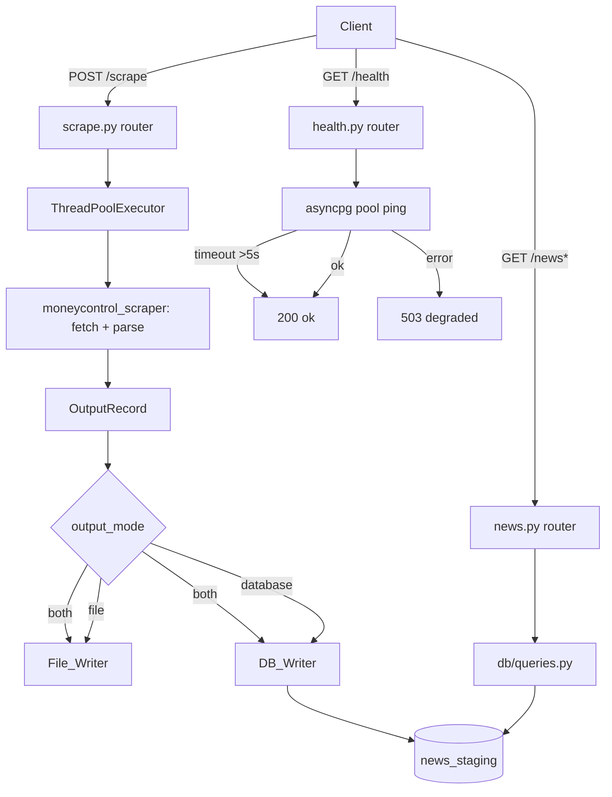
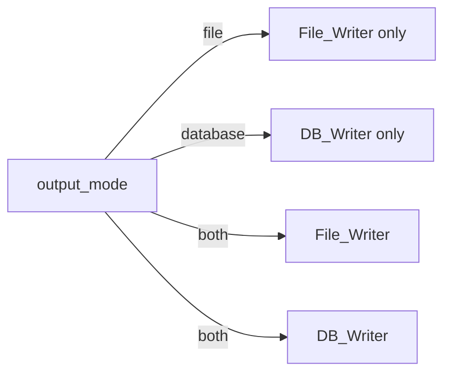

# Design Document: news-storage-api

## Overview

The `news-storage-api` extends the existing `moneycontrol-stocks-scraper` (Phase 2) with two capabilities:

1. **Database storage** — scraped `OutputRecord` objects can be persisted into the pre-existing PostgreSQL table `stoxscoop_dev.news_staging`, controlled by an `output_mode` config flag (`file`, `database`, or `both`).
2. **REST API** — a FastAPI application on port 8005 exposes endpoints to trigger scraping, store results, and query stored news records.

The existing CLI and file-output behaviour are preserved unchanged when `output_mode: file`.

The design adds a new `app/` package alongside the existing `moneycontrol_scraper/` package, and extends `moneycontrol_scraper/config.py` with two new fields. The scraper's synchronous `requests`-based HTTP logic is preserved; the API layer runs it in a thread pool executor to avoid blocking the async event loop.

---

## Architecture

```
stock-news-read/
├── moneycontrol_scraper/       # Existing package (minimally extended)
│   ├── config.py               # + output_mode, DatabaseConfig
│   └── ... (unchanged)
└── app/                        # New package
    ├── __init__.py
    ├── main.py                 # FastAPI app, lifespan, startup
    ├── config.py               # Extended config loader
    ├── schemas.py              # Pydantic models
    ├── db/
    │   ├── __init__.py
    │   ├── pool.py             # asyncpg connection pool management
    │   ├── writer.py           # DB_Writer: map OutputRecord → row, insert
    │   └── queries.py          # Raw SQL for read endpoints
    └── routers/
        ├── __init__.py
        ├── health.py           # GET /health
        ├── scrape.py           # POST /scrape
        └── news.py             # GET /news, GET /news/{id}, GET /news/by-url
```

### Request Flow



### Output Mode Routing



---

## Components and Interfaces

### `moneycontrol_scraper/config.py` — Extended Config

Two new dataclasses and two new fields are added to the existing module. The existing `ScraperConfig` and `load_config()` are extended, not replaced.

```python
@dataclass
class DatabaseConfig:
    host: str
    port: int          # 1–65535
    dbname: str
    user: str
    password: str
    schema: str

@dataclass
class ScraperConfig:
    # Existing fields (unchanged)
    urls: list[str]
    sections: list[str]
    output_dir: str
    delay: float
    # New fields
    output_mode: str = "file"          # "file" | "database" | "both" (case-insensitive)
    database: DatabaseConfig | None = None
```

**Validation rules** (applied in `load_config()`):
- `output_mode` is normalised to lowercase; if not in `{"file", "database", "both"}`, log error and `sys.exit(1)`.
- When `output_mode` is `"database"` or `"both"`, all six `database` keys must be present; if any is missing, log error with the key name and `sys.exit(1)`.

### `app/main.py` — FastAPI Application

```python
from contextlib import asynccontextmanager
from fastapi import FastAPI

@asynccontextmanager
async def lifespan(app: FastAPI):
    # Startup: create asyncpg pool, store on app.state.pool
    app.state.pool = await create_pool(config.database)
    yield
    # Shutdown: close pool within 30s
    await app.state.pool.close()

app = FastAPI(lifespan=lifespan)
app.include_router(health_router)
app.include_router(scrape_router)
app.include_router(news_router)
```

### `app/db/pool.py` — Connection Pool

```python
import asyncpg

async def create_pool(db_config: DatabaseConfig) -> asyncpg.Pool:
    """
    Create and return an asyncpg connection pool.
    Raises a descriptive error (including param name + value) if connection fails.
    Pool is stored on app.state.pool and shared across all requests.
    """

async def close_pool(pool: asyncpg.Pool, timeout: float = 30.0) -> None:
    """
    Close the pool gracefully within timeout seconds.
    Forcibly terminates connections if timeout is exceeded.
    """
```

Pool configuration (from `config.yaml`):
- `min_size`: integer 1–10 (default `2`)
- `max_size`: integer 1–100, ≥ `min_size` (default `10`)

### `app/db/writer.py` — DB_Writer

```python
from moneycontrol_scraper.models import OutputRecord

class DB_Writer:
    def __init__(self, pool: asyncpg.Pool, schema: str): ...

    async def write_batch(
        self, records: list[OutputRecord]
    ) -> tuple[int, int]:
        """
        Insert a batch of OutputRecord objects into news_staging.
        Returns (inserted_count, skipped_count).
        Uses INSERT ... ON CONFLICT (url) DO NOTHING.
        Retries up to 3 times with 1s delay on transient errors.
        """

    def map_record(self, record: OutputRecord) -> dict:
        """
        Map an OutputRecord to a dict matching the news_staging schema.
        Returns a dict with keys: url, source, title, published_date,
        content, extracted_stocks, is_loaded.
        Does NOT include created_at (relies on column DEFAULT).
        """

    def _extract_title(self, record: OutputRecord) -> str:
        """
        Title extraction priority:
        1. og:title meta tag from page HTML (if available in sections metadata)
        2. <title> HTML element
        3. Last non-empty path segment of URL, hyphens replaced with spaces, trimmed
        """

    def _extract_stocks(self, sections: dict) -> list[str]:
        """
        Union of all non-empty keys across all section dicts, deduplicated.
        Returns [] when sections is empty or yields no non-empty keys.
        """

    def _parse_published_date(self, date_str: str | None):
        """
        Parse YYYY-MM-DD string to midnight UTC datetime.
        Returns None for null or unparseable input.
        """
```

**INSERT statement** (in `queries.py`):
```sql
INSERT INTO {schema}.news_staging
    (url, source, title, published_date, content, extracted_stocks, is_loaded)
VALUES ($1, $2, $3, $4, $5, $6::jsonb, $7)
ON CONFLICT (url) DO NOTHING
```

**Retry logic**: On `asyncpg.PostgresConnectionError` or `asyncpg.TooManyConnectionsError`, retry up to 3 times with `asyncio.sleep(1)` between attempts. On permanent errors, rollback, log the URL, and continue to the next record.

### `app/db/queries.py` — Read Queries

```python
async def fetch_news_list(
    pool: asyncpg.Pool,
    schema: str,
    *,
    date: str | None = None,
    stock: str | None = None,
    source: str | None = None,
    page: int = 1,
    page_size: int = 20,
) -> tuple[list[dict], int]:
    """
    Returns (items, total).
    Filters: date → UTC day range, stock → JSONB @> with lower(),
    source → ILIKE. Ordered by created_at DESC.
    """

async def fetch_news_by_id(
    pool: asyncpg.Pool, schema: str, record_id: int
) -> dict | None: ...

async def fetch_news_by_url(
    pool: asyncpg.Pool, schema: str, url: str
) -> dict | None: ...
```

**Date filter SQL pattern**:
```sql
WHERE published_date >= $1::timestamptz   -- midnight UTC on date
  AND published_date <  $2::timestamptz   -- midnight UTC on date+1
```

**Stock filter SQL pattern**:
```sql
WHERE extracted_stocks @> to_jsonb(lower($1))
```

**Pagination SQL pattern**:
```sql
ORDER BY created_at DESC
LIMIT $page_size OFFSET ($page - 1) * $page_size
```

### `app/schemas.py` — Pydantic Models

```python
from pydantic import BaseModel, HttpUrl
from datetime import datetime

class NewsRecordSchema(BaseModel):
    id: int
    url: str
    source: str
    title: str
    published_date: datetime | None   # ISO 8601 with UTC offset, or null
    content: dict | None              # parsed JSON object, or null
    extracted_stocks: list[str]       # never null; [] when empty
    created_at: datetime              # ISO 8601 with UTC offset
    is_loaded: bool

    model_config = ConfigDict(from_attributes=True)

class ScrapeRequest(BaseModel):
    urls: list[HttpUrl]               # 1–50 items

    @field_validator("urls")
    def validate_urls(cls, v):
        if len(v) == 0:
            raise ValueError("At least one URL is required")
        if len(v) > 50:
            raise ValueError("At most 50 URLs are allowed")
        return v

class ScrapeResponse(BaseModel):
    processed: int
    inserted: int
    skipped: int
    failures: list[dict]              # [{"url": ..., "reason": ...}]

class NewsListResponse(BaseModel):
    items: list[NewsRecordSchema]
    total: int
    page: int
    page_size: int
```

### `app/routers/health.py`

```python
@router.get("/health")
async def health_check(request: Request) -> dict:
    """
    On-demand DB ping with 5s asyncio timeout.
    Returns 200 {"status": "ok"} on success or timeout.
    Returns 503 {"status": "degraded", "detail": reason} on connection failure.
    """
    try:
        async with asyncio.timeout(5.0):
            await request.app.state.pool.fetchval("SELECT 1")
        return {"status": "ok"}
    except asyncio.TimeoutError:
        return {"status": "ok"}   # optimistic on timeout
    except Exception as e:
        raise HTTPException(status_code=503, detail={"status": "degraded", "detail": str(e)})
```

### `app/routers/scrape.py`

```python
@router.post("/scrape", response_model=ScrapeResponse)
async def scrape(request: ScrapeRequest, req: Request) -> ScrapeResponse:
    """
    Runs scraper synchronously in a thread pool executor (scraper uses
    requests, not async). Persists results per output_mode config.
    Returns 200 on partial success, 502 if all URLs fail.
    """
    loop = asyncio.get_event_loop()
    results = await loop.run_in_executor(None, _run_scraper, request.urls)
    ...
```

### `app/routers/news.py`

```python
@router.get("/news", response_model=NewsListResponse)
async def list_news(
    date: str | None = None,
    stock: str | None = None,
    source: str | None = None,
    page: int = Query(default=1, ge=1),
    page_size: int = Query(default=20, ge=1, le=100),
    req: Request = ...,
) -> NewsListResponse: ...

@router.get("/news/by-url", response_model=NewsRecordSchema)
async def get_news_by_url(url: str, req: Request) -> NewsRecordSchema: ...

@router.get("/news/{id}", response_model=NewsRecordSchema)
async def get_news_by_id(id: int, req: Request) -> NewsRecordSchema: ...
```

> **Route ordering note**: `/news/by-url` must be registered before `/news/{id}` to prevent FastAPI from matching the literal string `"by-url"` as an integer path parameter.

---

## Data Models

### `OutputRecord` (existing, unchanged)

```python
@dataclass
class OutputRecord:
    date: str | None          # YYYY-MM-DD or None
    url: str
    sections: dict[str, dict[str, str]]
    # sections = { "Section Title": { "Stock Name": "news text" } }
```

### `news_staging` table (existing, unchanged)

```sql
CREATE TABLE IF NOT EXISTS stoxscoop_dev.news_staging (
    id              bigint PRIMARY KEY DEFAULT nextval('stoxscoop.news_staging_id_seq'),
    url             text NOT NULL UNIQUE,
    source          varchar(100) NOT NULL,
    title           text NOT NULL,
    published_date  timestamptz,
    content         text NOT NULL,
    extracted_stocks jsonb NOT NULL DEFAULT '[]',
    created_at      timestamptz NOT NULL DEFAULT now(),
    is_loaded       boolean DEFAULT false,
    CONSTRAINT news_staging_url_key UNIQUE (url)
)
```

### `OutputRecord` → `news_staging` mapping

| `OutputRecord` field | `news_staging` column | Transformation |
|---|---|---|
| `url` | `url` | Direct copy |
| *(hardcoded)* | `source` | Always `"moneycontrol"` |
| *(derived)* | `title` | `og:title` → `<title>` → URL slug (last path segment, hyphens→spaces, trimmed) |
| `date` | `published_date` | `YYYY-MM-DD` → midnight UTC `datetime`; `None`/invalid → `NULL` |
| `sections` | `content` | `json.dumps(sections)` stored as TEXT |
| `sections` keys | `extracted_stocks` | Union of all non-empty keys across all section dicts, deduplicated, as JSONB array |
| *(not supplied)* | `created_at` | Relies on column `DEFAULT now()` |
| *(hardcoded)* | `is_loaded` | Always `False` |

### `DatabaseConfig` dataclass

```python
@dataclass
class DatabaseConfig:
    host: str
    port: int       # 1–65535
    dbname: str
    user: str
    password: str
    schema: str
    min_pool_size: int = 2    # 1–10
    max_pool_size: int = 10   # 1–100, >= min_pool_size
```

### `config.yaml` extended format

```yaml
output_mode: database   # file | database | both (case-insensitive)
output_dir: output
delay: 1.0
urls: []
sections: []

database:
  host: localhost
  port: 5432
  dbname: stoxscoop_dev
  user: myuser
  password: mypassword
  schema: stoxscoop_dev
  min_pool_size: 2
  max_pool_size: 10
```

---

## Correctness Properties

*A property is a characteristic or behavior that should hold true across all valid executions of a system — essentially, a formal statement about what the system should do. Properties serve as the bridge between human-readable specifications and machine-verifiable correctness guarantees.*

**Property reflection:** After reviewing all prework-identified properties, the following consolidations were made:
- Requirements 1.2, 1.3, and 1.4 (output routing for each mode) are combined into one comprehensive routing property (P1), since they all test the same routing logic with different mode values.
- Requirements 2.1, 2.2, 2.8, and 2.9 (field mapping invariants: url, source, is_loaded, no created_at) are combined into one comprehensive field mapping property (P2), since they all assert constant or direct-copy invariants on the mapped row.
- Requirements 2.4 and 2.5 (published_date mapping including null/invalid) are combined into P2 since the property generator can include null and invalid dates.
- Requirements 2.6 and 10.1 (content round-trip) are the same property; covered by P5.
- Requirements 7.1 and 7.5 (pagination) are the same property; covered by P6.
- Requirements 9.1, 9.2, 9.3, 9.4 (response schema) are combined into one property (P8) since they all assert invariants on the response object shape.
- Requirements 10.2 (extracted_stocks round-trip) is subsumed by P3 (deduplication) since if deduplication is correct and the set is preserved, the round-trip is also correct.

---

### Property 1: output_mode routing

*For any* `output_mode` value in `{"file", "database", "both"}` (case-insensitive), the scraper SHALL route output to exactly the correct destination(s): `file` routes only to File_Writer, `database` routes only to DB_Writer, `both` routes to both File_Writer and DB_Writer, and no mode routes to a destination not indicated by the mode value.

**Validates: Requirements 1.1, 1.2, 1.3, 1.4**

---

### Property 2: DB field mapping invariants

*For any* `OutputRecord` with a valid `url`, `date`, and `sections`, the mapped DB row SHALL satisfy all of the following simultaneously: `source == "moneycontrol"`, `is_loaded == False`, `"created_at"` is absent from the row dict (not supplied to INSERT), and `published_date` equals midnight UTC of the `date` string (or `None` when `date` is `None` or unparseable).

**Validates: Requirements 2.1, 2.2, 2.4, 2.5, 2.8, 2.9**

---

### Property 3: extracted_stocks deduplication

*For any* `OutputRecord` whose sections contain stock name keys (with possible duplicates across sections and possible empty strings), the `extracted_stocks` array SHALL contain exactly the set of unique non-empty stock names — no duplicates, no empty strings, and no stock names that were not present as keys in the original sections.

**Validates: Requirements 2.7**

---

### Property 4: duplicate URL skip

*For any* batch of `OutputRecord` objects where a subset of URLs already exist in `news_staging`, the DB_Writer SHALL insert exactly the non-duplicate records, skip the duplicate records without raising an error, and return `(len(new_records), len(duplicate_records))` as the `(inserted, skipped)` counts.

**Validates: Requirements 3.1, 3.3**

---

### Property 5: content round-trip

*For any* `OutputRecord` with arbitrary `sections` (including nested dicts with arbitrary string keys and values), serialising `sections` to a JSON string via `json.dumps` and then deserialising via `json.loads` SHALL produce an object with identical keys, identical nested keys, and identical string values as the original `sections` object, regardless of key ordering.

**Validates: Requirements 2.6, 10.1**

---

### Property 6: pagination correctness

*For any* `GET /news` request with `page=P` and `page_size=S` against a database containing N matching records, the response SHALL satisfy all of the following: `len(items) <= S`, `total == N` (regardless of pagination), and items are ordered by `created_at` descending.

**Validates: Requirements 7.1, 7.5, 7.6**

---

### Property 7: date filter UTC boundary

*For any* `date=YYYY-MM-DD` filter on `GET /news`, only records with `published_date >= midnight UTC on that date` AND `published_date < midnight UTC on the next calendar date` SHALL be returned; records with `published_date` outside this half-open interval SHALL NOT appear in the results.

**Validates: Requirements 7.2**

---

### Property 8: response schema completeness

*For any* `News_Record` returned by any API endpoint, the JSON response object SHALL contain exactly the fields `id`, `url`, `source`, `title`, `published_date`, `content`, `extracted_stocks`, `created_at`, and `is_loaded`; `published_date` and `created_at` SHALL be ISO 8601 strings with a UTC timezone offset (never naive); `extracted_stocks` SHALL be a JSON array (never `null`); and no additional top-level fields SHALL be present.

**Validates: Requirements 9.1, 9.2, 9.3, 9.4**

---

## Error Handling

| Scenario | Component | Behaviour |
|---|---|---|
| Invalid `output_mode` value | `config.py` / `load_config()` | Log error with invalid value, `sys.exit(1)` |
| Missing required DB config key | `config.py` / `load_config()` | Log error with missing key name, `sys.exit(1)` |
| DB connection failure at startup | `app/db/pool.py` / `create_pool()` | Raise `RuntimeError` with param name + configured value |
| INSERT transient error (`PostgresConnectionError`, `TooManyConnectionsError`) | `app/db/writer.py` / `write_batch()` | Retry up to 3 times with 1s delay; after 3 failures, log error with URL and continue |
| INSERT permanent error | `app/db/writer.py` / `write_batch()` | Rollback transaction, log error with URL, continue to next record |
| Duplicate URL on INSERT | `app/db/writer.py` / `write_batch()` | `ON CONFLICT DO NOTHING`; log INFO with URL; increment skipped count |
| `POST /scrape` — all URLs fail | `app/routers/scrape.py` | Return HTTP 502 with list of failed URLs and reasons |
| `POST /scrape` — partial failure | `app/routers/scrape.py` | Return HTTP 200 with failures list populated |
| `GET /news/{id}` — record not found | `app/routers/news.py` | Return HTTP 404 with `{"detail": "Record not found"}` |
| `GET /news/by-url` — missing `url` param | FastAPI validation | Return HTTP 422 with validation error message |
| `GET /health` — DB unreachable | `app/routers/health.py` | Return HTTP 503 with `{"status": "degraded", "detail": reason}` |
| `GET /health` — DB check timeout (>5s) | `app/routers/health.py` | Return HTTP 200 with `{"status": "ok"}` (optimistic) |
| `output_mode: both` — file write succeeds, DB fails | `cli.py` / scrape router | Log DB error, continue; exit non-zero after all URLs processed |
| `output_mode: both` — DB succeeds, file write fails | `cli.py` / scrape router | Log file error, continue; exit non-zero after all URLs processed |
| Pool shutdown timeout exceeded | `app/db/pool.py` / `close_pool()` | Forcibly terminate connections after 30s |

---

## Testing Strategy

### Dual Testing Approach

The test suite uses both **example-based unit tests** (pytest) and **property-based tests** ([Hypothesis](https://hypothesis.readthedocs.io/)) for comprehensive coverage.

- **Unit tests** cover specific examples, integration points, edge cases, and API endpoint behaviour.
- **Property tests** verify universal invariants across randomly generated inputs.
- **Async tests** use `pytest-asyncio` with `httpx.AsyncClient` for FastAPI integration tests.
- **DB mocking** uses `unittest.mock.AsyncMock` to mock `asyncpg` pool and connection objects.

### Property-Based Testing Library

**[Hypothesis](https://hypothesis.readthedocs.io/)** is the chosen PBT library. Each property test is configured with `@settings(max_examples=100)` (minimum) and tagged with a comment referencing the design property.

Tag format: `# Feature: news-storage-api, Property {N}: {property_text}`

### Test File Layout

```
tests/
├── test_app_config.py       # P1: output_mode routing; config validation (R1)
├── test_db_writer.py        # P2, P3, P4: field mapping, deduplication, duplicate skip (R2, R3)
├── test_db_queries.py       # P6, P7: pagination, date filter (R7)
├── test_serialisation.py    # P5: content round-trip (R2.6, R10)
├── test_health.py           # health endpoint examples (R5)
├── test_scrape_endpoint.py  # POST /scrape integration (R6)
└── test_news_endpoints.py   # GET /news, GET /news/{id}, GET /news/by-url (R7, R8, R9)
```

### Property Test Specifications

| Property | Hypothesis Strategy |
|---|---|
| P1 (output_mode routing) | `st.sampled_from(["file", "FILE", "File", "database", "DATABASE", "both", "BOTH"])` for valid modes; `st.text().filter(lambda s: s.lower() not in {"file","database","both"})` for invalid |
| P2 (DB field mapping) | Composite strategy: `st.text(min_size=1)` for url, `st.dates()` for date, `st.none()` for null date, `st.text()` for invalid date strings |
| P3 (extracted_stocks dedup) | `st.dictionaries(st.text(), st.dictionaries(st.text(), st.text()))` for sections with arbitrary keys |
| P4 (duplicate URL skip) | `st.lists(st.from_type(OutputRecord), min_size=1)` with a pre-populated set of "existing" URLs |
| P5 (content round-trip) | `st.dictionaries(st.text(), st.dictionaries(st.text(), st.text()))` for sections |
| P6 (pagination) | `st.integers(min_value=1, max_value=10)` for page, `st.integers(min_value=1, max_value=100)` for page_size |
| P7 (date filter) | `st.dates()` for filter date; generate records with published_dates spanning the boundary |
| P8 (response schema) | `st.from_type(NewsRecordSchema)` or composite strategy building valid records |

### Unit Test Coverage

| Requirement | Test type | File |
|---|---|---|
| R1.5 (default output_mode=file) | Example | `test_app_config.py` |
| R1.6 (invalid output_mode → exit 1) | Edge case | `test_app_config.py` |
| R1.8 (missing DB key → exit 1) | Edge case | `test_app_config.py` |
| R1.9 (both mode partial failure) | Example | `test_app_config.py` |
| R2.3 (title extraction priority) | Example | `test_db_writer.py` |
| R3.2 (log skipped URL) | Example | `test_db_writer.py` |
| R4.1 (pool min/max size) | Example | `test_db_writer.py` |
| R4.2 (connection failure at startup) | Example | `test_db_writer.py` |
| R4.3 (INSERT error → rollback + continue) | Example | `test_db_writer.py` |
| R4.5 (transient error → 3 retries) | Example | `test_db_writer.py` |
| R5.2 (GET /health → 200) | Example | `test_health.py` |
| R5.3 (GET /health DB unreachable → 503) | Example | `test_health.py` |
| R5.4 (GET /health timeout → 200) | Example | `test_health.py` |
| R6.1 (POST /scrape 0 URLs → 422) | Edge case | `test_scrape_endpoint.py` |
| R6.1 (POST /scrape 51 URLs → 422) | Edge case | `test_scrape_endpoint.py` |
| R6.5 (invalid URL → 422) | Edge case | `test_scrape_endpoint.py` |
| R6.6 (partial failure → 200 + failures list) | Example | `test_scrape_endpoint.py` |
| R6.7 (all fail → 502) | Example | `test_scrape_endpoint.py` |
| R7.3 (stock filter case-insensitive) | Example | `test_news_endpoints.py` |
| R7.4 (source filter case-insensitive) | Example | `test_news_endpoints.py` |
| R7.7 (no matches → 200 empty) | Edge case | `test_news_endpoints.py` |
| R7.8 (invalid date format → 422) | Edge case | `test_news_endpoints.py` |
| R7.9 (page/page_size out of range → 422) | Edge case | `test_news_endpoints.py` |
| R8.3 (GET /news/{id} not found → 404) | Example | `test_news_endpoints.py` |
| R8.6 (GET /news/by-url not found → 404) | Example | `test_news_endpoints.py` |
| R8.7 (non-integer id → 422) | Edge case | `test_news_endpoints.py` |
| R8.8 (missing url param → 422) | Edge case | `test_news_endpoints.py` |
| R9.3 (content as parsed object or null) | Example | `test_news_endpoints.py` |
| R9.4 (extracted_stocks never null) | Example | `test_news_endpoints.py` |

### Running Tests

```bash
# Install dev dependencies
pip install pytest hypothesis pytest-asyncio httpx

# Run all tests (single pass)
pytest tests/ -v

# Run only property-based tests
pytest tests/ -v -k "property"

# Run with increased Hypothesis examples
pytest tests/ --hypothesis-seed=0 -v
```
